# Mermaid

---

- TB - 위에서 아래로
- TD - 탑다운
- BT - 아래에서 위로
- LR - 왼쪽에서 오른쪽
- RL - 오른쪽에서 왼쪽으로

---

* `-|\`   윗부분이 화살촉 모양인 실선
* `--|\`	점선에 위쪽 절반이 화살표 모양인
* `-|/`   아래쪽 절반이 화살표 모양인 실선
* `--|/`	아래쪽 절반이 화살표 모양인 점선
* `/|-`   실선에 위쪽 절반이 뒤집힌 화살촉 모양
* `/|--`	점선에 위쪽 절반이 뒤집힌 화살표
* `\\-`   아래쪽 절반이 반전된 화살표 모양의 실선
* `\\--`	점선에 아래쪽 절반이 뒤집힌 화살표
* `-\\`   윗부분이 반쪽 화살촉 모양인 실선
* `--\\`	점선, 위쪽 막대 반쪽 화살촉
* `-//`   아래쪽 막대가 반쪽 화살촉 모양인 실선
* `--//`	점선, 아래쪽 막대 반쪽 화살촉
* `//-`   실선에 역방향 상단 막대 반쪽 화살촉이 있는 형태
* `//--`	점선, 위쪽 막대의 반대쪽 화살표
* `\\-`   아래쪽 막대가 뒤집힌 반쪽 화살촉 모양의 실선
* `\\--`	점선, 아래쪽 막대의 반대쪽 반쪽 화살촉
* `-|\`   윗부분이 화살촉 모양인 실선
* `--|\`	점선에 위쪽 절반이 화살표 모양인
* `-|/`   아래쪽 절반이 화살표 모양인 실선
* `--|/`	아래쪽 절반이 화살표 모양인 점선
* `/|-`   실선에 위쪽 절반이 뒤집힌 화살촉 모양
* `/|--`	점선에 위쪽 절반이 뒤집힌 화살표
* `\\-`   아래쪽 절반이 반전된 화살표 모양의 실선
* `\\--`	점선에 아래쪽 절반이 뒤집힌 화살표
* `-\\`   윗부분이 반쪽 화살촉 모양인 실선
* `--\\`	점선, 위쪽 막대 반쪽 화살촉
* `-//`   아래쪽 막대가 반쪽 화살촉 모양인 실선
* `--//`	점선, 아래쪽 막대 반쪽 화살촉
* `//-`   실선에 역방향 상단 막대 반쪽 화살촉이 있는 형태
* `//--`	점선, 위쪽 막대의 반대쪽 화살표
* `\\-`   아래쪽 막대가 뒤집힌 반쪽 화살촉 모양의 실선
* `\\--`	점선, 아래쪽 막대의 반대쪽 반쪽 화살촉

---

### 확장

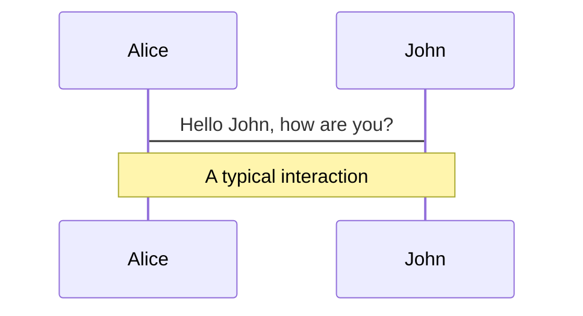

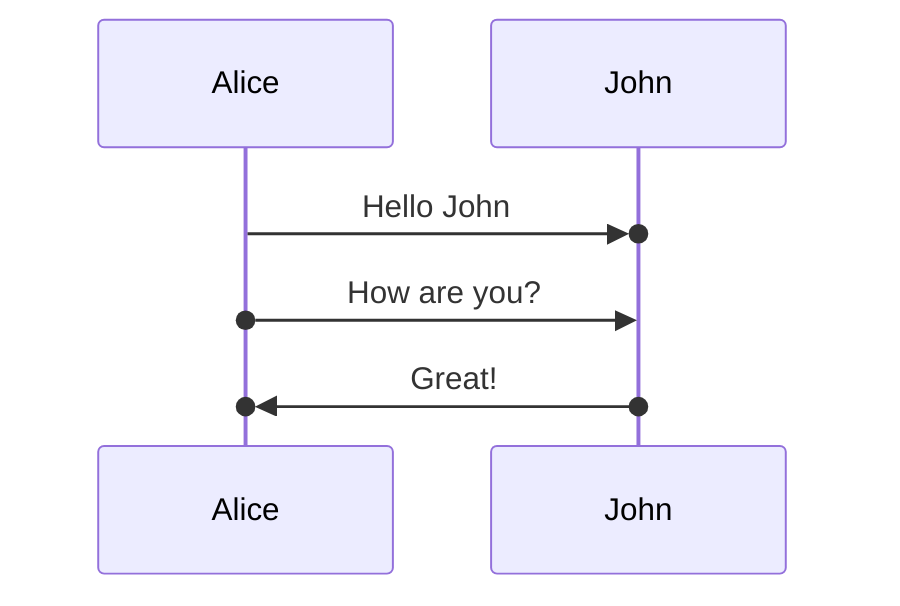

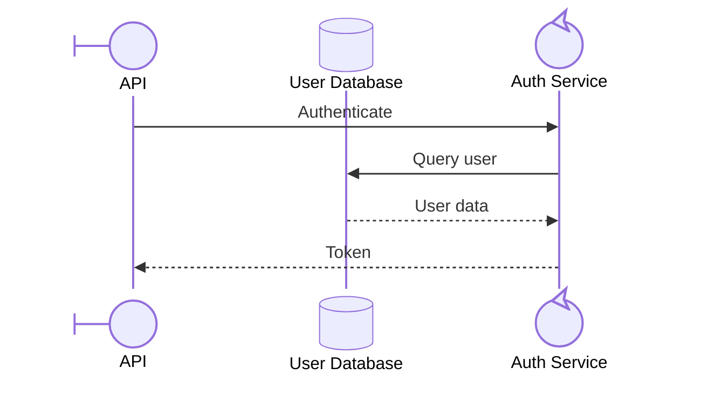

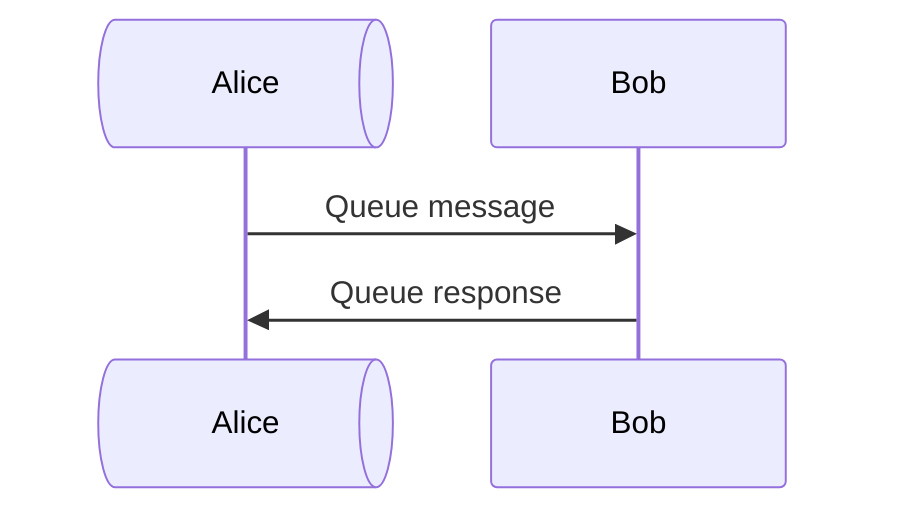

---

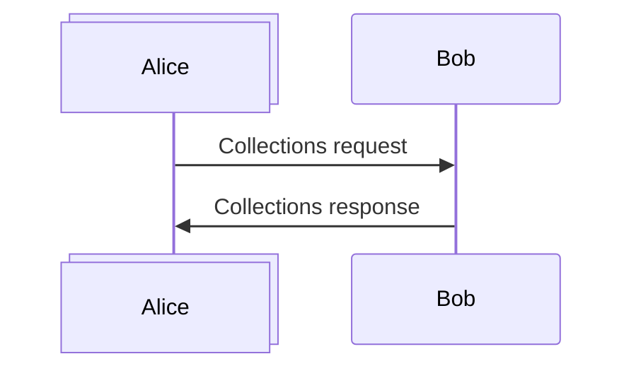

--- 

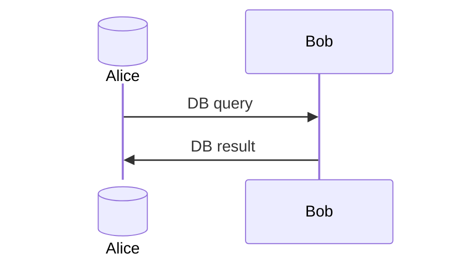

---

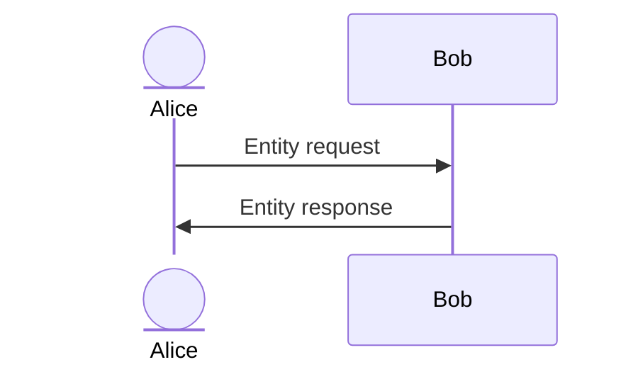

---

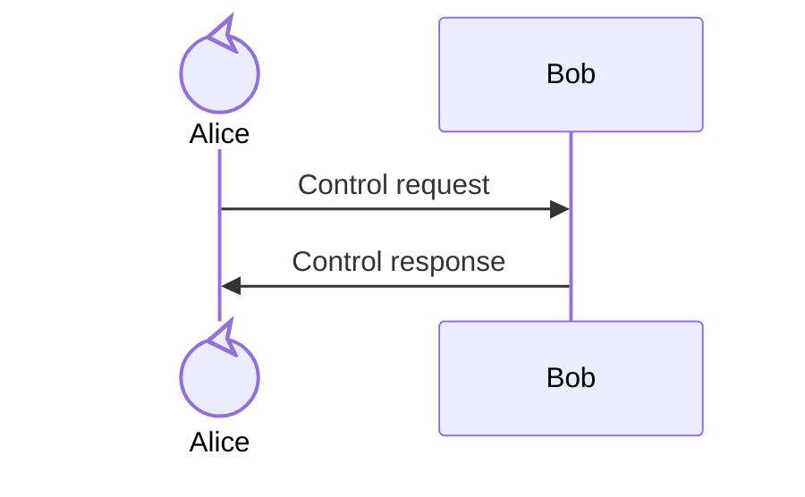

---

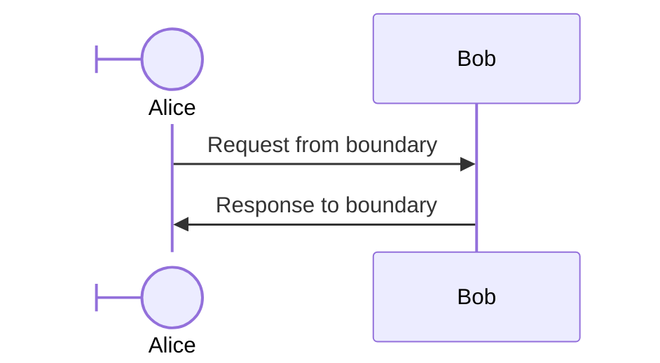

---

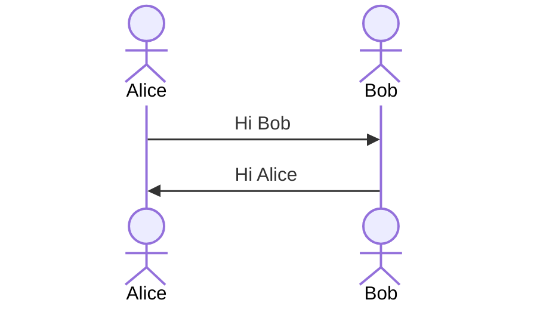

---

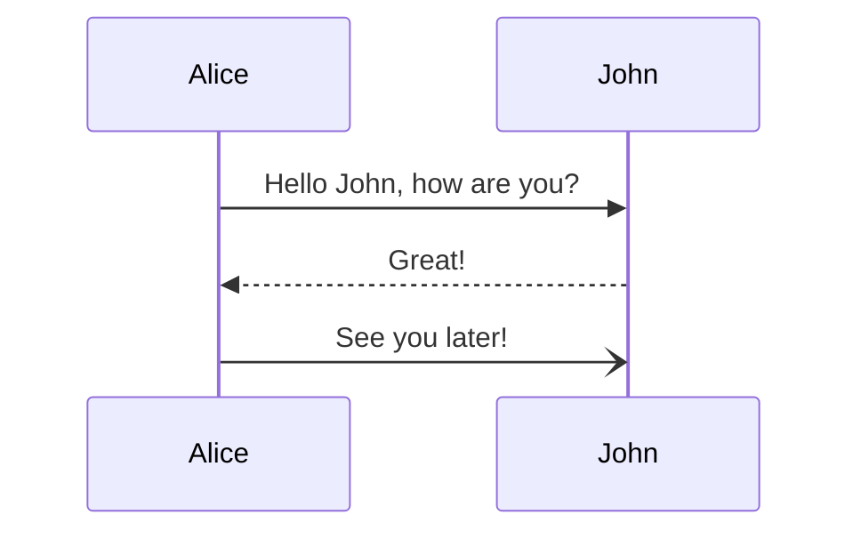

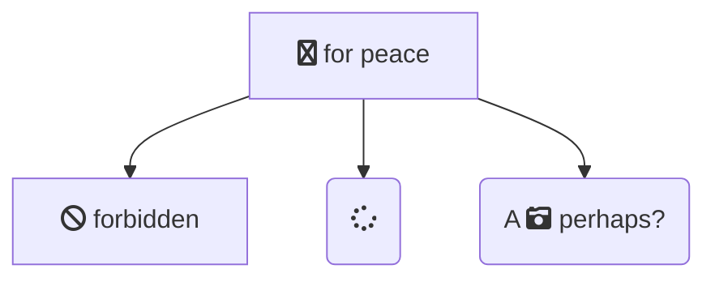
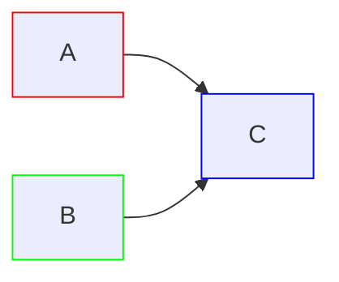

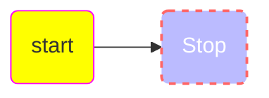

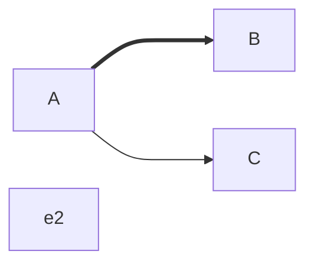

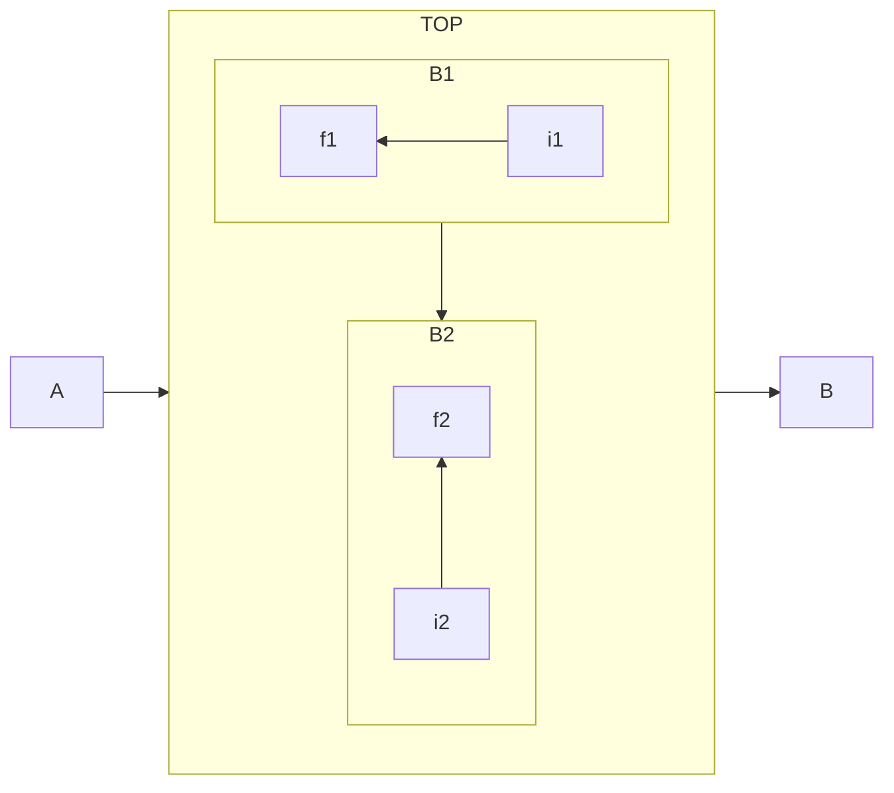

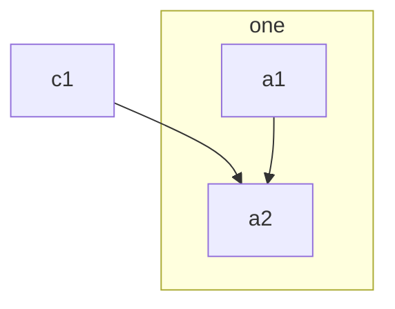

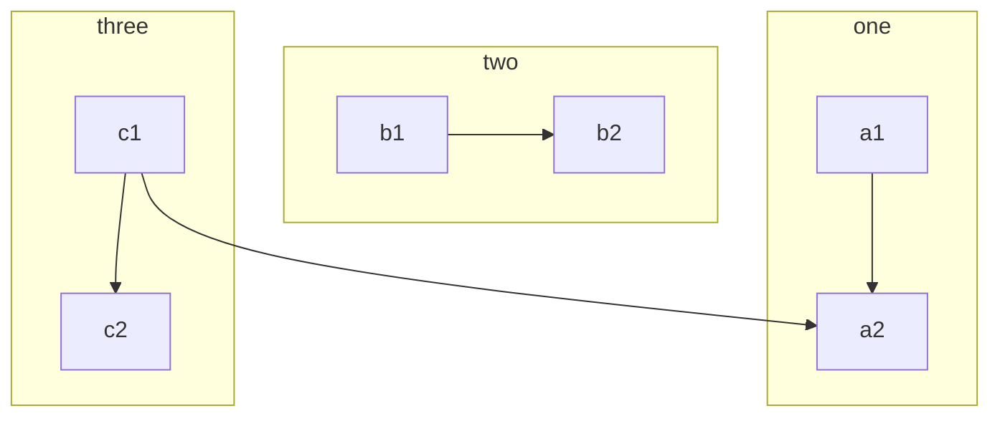

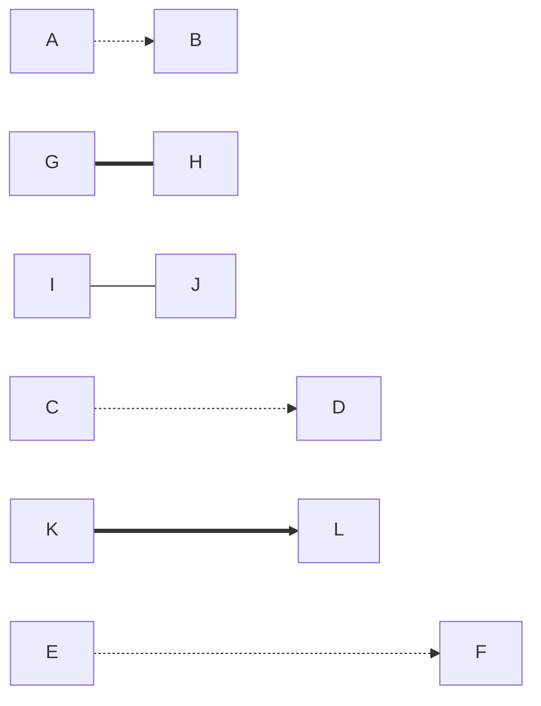

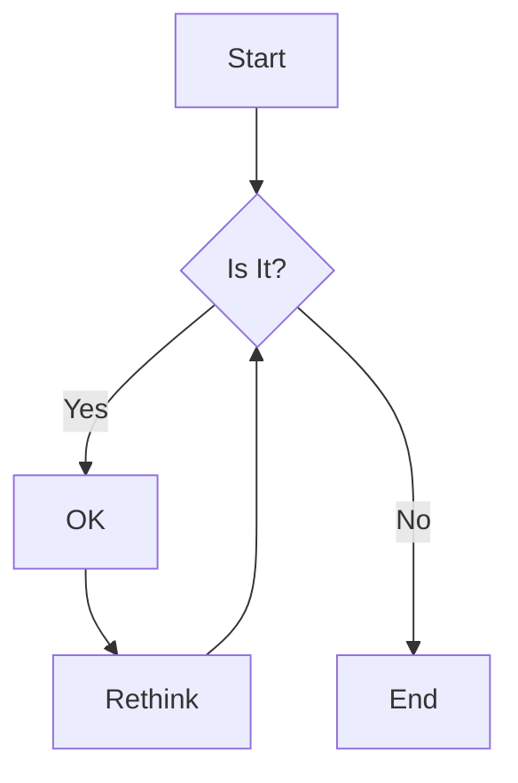
```mermaid
flowchart LR
  A e1@--> B
  e1@{ animation: fast }
  
  C --o D
  E --x F
  G <--> H
  I o--o J
```

```mermaid
flowchart LR
  A e1@===> B
  e1@{ animate: true }
```

```mermaid
flowchart TB
  A & B --> C & D
```

```mermaid
flowchart LR
  a --> b & c --> d
  N -- text --> O -- text2 --> P
```

```mermaid
flowchart LR
  A-- text -->B
  C-.->D
  E-. text .->F
  H ==> I
  J ==text==>K
  L ~~~ M

  
  
```

```mermaid
flowchart LR
  A-->B
  C---D
  E-- This is Test ---F
  G---|This is text|H
  J-->|text|K
```

```mermaid
flowchart TD
  %% My image with a constrained aspect ratio
  A@{ img: "https://mermaid.js.org/favicon.svg", label: "My example image label", pos: "t", h: 60, constraint: "on" }

```

```mermaid
flowchart TD
  A@{ icon: "fa:usr", form:"square", label: "user Icon" }

```


```mermaid
flowchart TD
  A@{ shape: rect, label: "This is a process" }
  B@{ shape: rounded, label: "This is an event" }
  C@{ shape: stadium, label: "Termianl point" }
  D@{ shape: subproc, label: "This is a subprocess" }
  E@{ shape: braces, label: "Comment" }
  F@{ shape: delay, label: "Delay" }
  G@{ shape: das, label: "Direct access strage" }
  H@{ shape: lin-cyl, label: "Disk storage" }
  I@{ shape: curv-trap, label: "Display"}
  J@{ shape: div-rect, label: "Divide process" }
  K@{ shape: tri, label: "Extract" }
  H-->I-->J-->K
  A-->B-->C-->D
  G-->F-->E
```

```mermaid
flowchart RL
  A@{ shape: manual-file, label: "File" }
  B@{ shape: manual-input, label: "User Input"}
  C@{ shape: docs, label: "다중문서" }
  D@{ shape: procs, label: "Process Automation" }
  E@{ shape: paper-tape, label: "Paper Records" }
  
  A-->B
  C-->D-->E
```


```mermaid
flowchart BT
  우선조치@{ shape: trap-b }
  텍스트블록@{ shape: text }
  종착점@{ shape: terminal }
  태그된프로세스@{ shape: tag-rect }
  태그된문서@{ shape: tag-doc }
  요약@{ shape: summary }
  저장된데이터@{ shape: bow-rect }
  정지지점@{ shape: stop }
  정지@{ shape: dbl-circ }
  시작@{ shape: start }
  원@{ shape: circ } 
  

  시작-->정지지점-->정지-->요약--> 저장된데이터
  우선조치-->텍스트블록-->종착점-->태그된문서
  -->태그된프로세스

```

```mermaid
flowchart TB
  조인@{ shape: fork }
  내부저장소@{ shape: win-pane }
  교차점@{ shape: f-circ }
  문서@{ shape: lin-doc }
  선@{ shape: lin-rect }
  루프제한@{ shape: loop-limit }
  수동파일@{ shape: flip-tri }
  수동입력@{ shape: sl-rect }
  수동작동@{ shape: trap-t }
  다중문서@{ shape: docs }
  멀티프로세스@{ shape: processes }
  특이한모양@{ shape: odd }
  깃발@{ shape: flag }
  준비@{ shape: hex }
  깃발 --> 특이한모양 --> 멀티프로세스-->다중문서
  준비-->수동입력 ---> 수동작동
  조인 --> 내부저장소 ==> 교차점 <==> 문서
  선--->루프제한-->수동파일
```

```mermaid
flowchart TB
  A@{ shape: rect }
  RET@{ shape: flag }
  B@{ shape: bang }
  C@{ shape: cloud}
  D@{ shape: card }
  E@{ shape: collate }
  F@{ shape: bolt }

  G@{ shape: brace }
  H@{ shape: brace-r }
  I@{ shape: lean-r }
  J@{ shape: lean-l }
  K@{ shape: datastore }
  database@{ shape: db }
  의사결정@{ shape: diam }
  delay@{ shape: delay }
  디스크@{ shape: das }
  디스크1@{ shape: disk }
  display@{ shape: display }
  process@{ shape: process }
  doc@{ shape: doc }
  event@{ shape: event }
  triangle@{ shape: triangle }
  
  event --> doc --> process --> display
  display --> 디스크 --> 디스크1
  K --> database --> triangle
  I --> J --> 의사결정 --> delay
  G --> H
  H --> F
  C --> D --> E --> F
  F --> D
  A --> RET --> B
  B --> A


```

### 평행사변형

```mermaid
flowchart TD
  id[/평행사변형/]
  id1[\평행사변형\]
  id2[/사다리꼴\]
  id3[\역 사다리꼴/]

```
### 육각형 
```mermaid
flowchart LR
  id{{육각형}}

```

### 마름모

```mermaid
flowchart LR
  id{마름모}


```

### 비대칭 노드

```mermaid
flowchart LR
  id>this is the text in the box]

```


### 원형

```mermaid
flowchart TB
  circle((원형 노드))
  circle1(((이중원)))
```

### 데이터베이스

```mermaid
flowchart TD
  database[(데이터베이스)]
```

---

### 서브루틴

```mermaid
flowchart BT
  std[[서브루틴]]
```

---

### 모서리가 둥근 노드

```mermaid
flowchart LR
  mov(둥근모서리)
  str([경기장 모양])

```


```mermaid
flowchart TD
  start-->stop
```


```mermaid
---
config:
  htmlLabels: false
---
flowchart LR
  markdown["`this **is** _Markdown_`"]
  newLines["`Line 1
  Line 2
  Line 3
  `"]
  markdown --> newLines

  id1[This is the text]
  id2["안녕 하세요 ❤ 반갑습니다."]

```


```mermaid
flowchart LR
  Sleep[Sleep] --> Wake{Awake?}
  Wake -->|No| Sleep
  Wake -->|Hungry| Snack[Get treat]
  Wake -->|Not in in Sun?| Move[Move to sun]
  Wake -->|Human is typing| Keyboard[Sleep on keyboard]
  Snack --> Sleep
  Move --> Sleep
  Keyboard --> Sleep
```

```mermaid
sequenceDiagram
    participant main
    participant menu_forloop
    main->>menu_forloop: bl (x30에 복귀주소 저장)
    menu_forloop-->>main: ret (x30 주소로 복귀)
```

