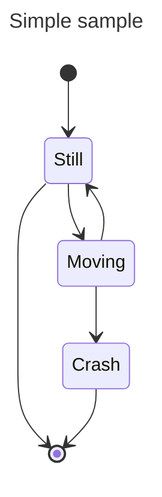
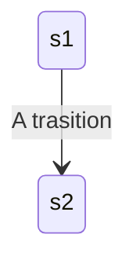
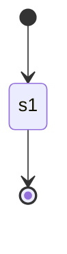

# State Diagrams


```mermaid
---
title: Simple sample
---
stateDiagram-v2
  [*] --> Still
  Still --> [*]
  
  Still --> Moving
  Moving --> Still
  Moving --> Crash
  Crash --> [*]
```


```mermaid
stateDiagram-v2
  s1 --> s2: A trasition
```


```mermaid
stateDiagram-v2
  [*] --> s1
  s1 --> [*]
```

```mermaid

```