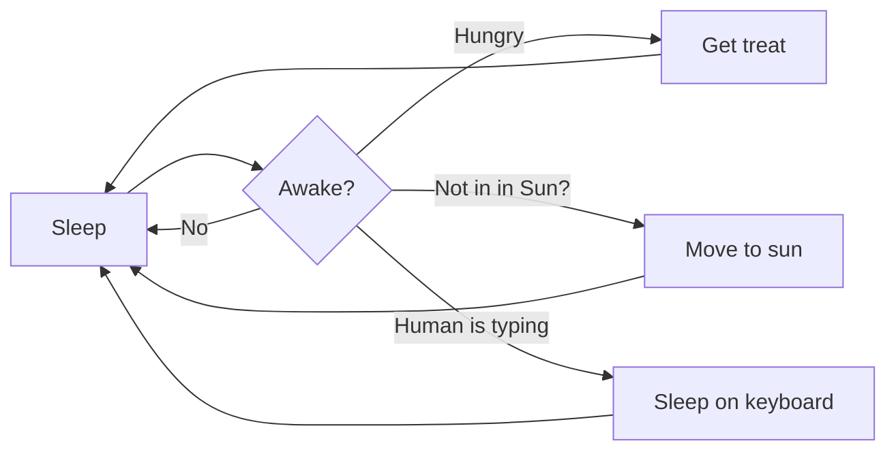
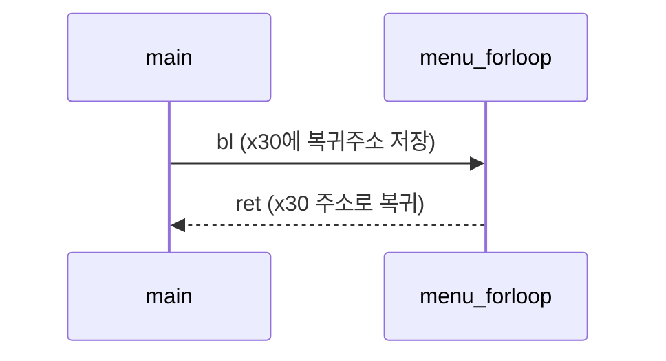

# 제어흐름

## bl ret 

```mermaid
flowchart LR
  Sleep[Sleep] --> Wake{Awake?}
  Wake -->|No| Sleep
  Wake -->|Hungry| Snack[Get treat]
  Wake -->|Not in in Sun?| Move[Move to sun]
  Wake -->|Human is typing| Keyboard[Sleep on keyboard]
  Snack --> Sleep
  Move --> Sleep
  Keyboard --> Sleep
```

```mermaid
sequenceDiagram
    participant main
    participant menu_forloop
    main->>menu_forloop: bl (x30에 복귀주소 저장)
    menu_forloop-->>main: ret (x30 주소로 복귀)
    

```