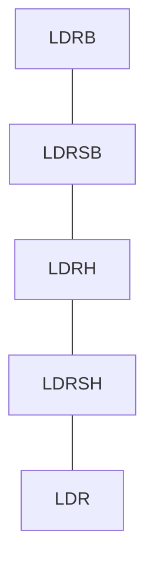

# LDRB (Load Register Byte)

> `ldr` 이 기본적으로 레지스터 폭(`x`면 8바이트, `w`면 4바이트) 만큼
> 메모리에서 읽어 오는 반면,
> `ldrb`는 딱 1바이트(8비트)만 읽어 와서 대상 레지스터의 하위 8비트에 넣고
> 나머지 상위 비트는 전부 0으로 채웁니다. (zero-extend)

### 기본형식

```assembly
ldrb w0, [x1]        // x1이 가리키는 주소에서 1바이트만 읽어 w0에 저장 (상위비트 0으로 채움)
```

### 언제 쓰는가 

1. 문자열을 한 글자씩 순회할 때 (가장 흔한 용도)
2. `char`, `uint8_t`, `bool` 타입 데이터 읽기
3. 버퍼/네트워크 패킷 파싱

```asm
.L_strlen_loop:
	ldrb w2, [x1], #1      // 한 글자 읽고, x1은 자동으로 +1 (post-index)
	cbz  w2, .L_strlen_end // 널 종료 문자(0)면 끝
	add  x0, x0, #1        // 길이 카운트
	b    .L_strlen_loop
```

### 관련니모닉

