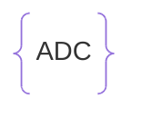

# Hun ARM64 Mnemonic Dictionary

> 224 mnemonics  

---



$\divideontimes$ `Add with Carry` Adds two operands plus the current carry flag (Xd = Xn + Xm + C). Used to chain addition across multiple registers for values wider than 64 bits, following an ADDS on the lower word.  


$\circ$ `캐리를 포함한 덧셈`. 두 피연산자와 현재 캐리 플래그를 함께 더합니다 (Xd = Xn + Xm + C). 64비트보다 큰 값을 여러 레지스터에 걸쳐 더할 때, 하위 워드의 ADDS 다음에 이어서 사용합니다.

**Syntax**
```asm
ADC <Wd|Xd>, <Wn|Xn>, <Wm|Xm>
```

**Example**
```asm
ADDS X0, X2, X4   // 하위 64비트 더하기 (캐리 플래그 갱신)
ADC  X1, X3, X5   // 상위 64비트 + 캐리 -> 128비트 덧셈 완성
```

---


**EN:** Add with Carry, setting flags. Same as ADC but also updates the NZCV flags, allowing the carry chain to continue into a further ADC/ADCS for even wider (192-bit+) arithmetic.

**KO:** 캐리를 포함한 덧셈 후 플래그 설정. `ADC`와 동일하지만 `NZCV` 플래그도 갱신하여, 더 넓은(192비트 이상) 연산을 위해 캐리 체인을 계속 이어갈 수 있습니다.

**Syntax**
```asm
ADCS <Wd|Xd>, <Wn|Xn>, <Wm|Xm>
```

**Example**
```asm
ADCS X1, X3, X5
```

---


**EN:** Add (register or immediate). Adds two operands and stores the result in the destination register.

**KO:** 덧셈 (레지스터 또는 즉시값). 두 피연산자를 더하여 결과를 대상 레지스터에 저장합니다.

**Syntax**

```asm
ADD <Wd|Xd>, <Wn|Xn>, <Wm|Xm>  or  ADD <Wd|Xd>, <Wn|Xn>, #<imm>
```

**Example**

```asm
ADD X0, X1, X2
ADD W0, W1, #5
```

---


**EN:** Add, setting flags. Same as ADD but also updates the NZCV condition flags based on the result. XZR as destination makes this the CMN alias (compare negative, result discarded).

**KO:** 덧셈 후 플래그 설정. ADD와 동일하게 더하지만, 결과에 따라 NZCV 조건 플래그도 함께 갱신합니다. 대상 레지스터를 XZR로 쓰면 결과를 버리는 CMN(음수 비교) 별칭이 됩니다.

**Syntax**
```asm
ADDS <Wd|Xd>, <Wn|Xn>, <Wm|Xm>  or  ADDS <Wd|Xd>, <Wn|Xn>, #<imm>
```

**Example**
```asm
ADDS X0, X1, X2
B.VS overflow_label   // 오버플로 발생시 분기
```

---


**EN:** Add across Vector. Sums every lane of a vector together into a single scalar result written to one lane of the destination. The classic horizontal-reduction step after a vectorized dot product.

**KO:** 벡터 전체 합산. 벡터의 모든 레인 값을 다 더해서 하나의 스칼라 결과로 만들어 대상 레인에 씁니다. 벡터화된 내적 계산 뒤에 흔히 오는 수평 축소(reduction) 단계입니다.

**Syntax**
```asm
ADDV <V><d>, <Vn>.<T>
```

**Example**
```asm
ADDV S0, V1.4S   // V1의 4개 레인 합계를 S0에
```

---

## `ADR`

**EN:** Form PC-relative address. Computes the exact byte address of a nearby label (within ±1MB) and writes it to the destination register. Unlike ADRP, no page offset is needed.
**KO:** PC 상대 주소를 계산합니다. 가까운(±1MB 이내) 라벨의 정확한 바이트 주소를 구해 대상 레지스터에 저장합니다. ADRP와 달리 페이지 오프셋 계산이 필요 없습니다.)

**Syntax**
```asm
ADR <Xd>, <label>
```

**Example**
```asm
ADR x0, local_data
```

---

## `ADRP` (페이지주소)

**EN:** Form PC-relative address to a 4KB page. Computes the address of the 4KB page containing a label and writes it to the destination register; usually paired with ADD ...@PAGEOFF or LDR to reach the exact byte.
**KO:** 4KB 페이지 단위의 PC 상대 주소를 계산합니다. 라벨이 속한 4KB 페이지의 시작 주소를 구해 대상 레지스터에 저장하며, 보통 정확한 바이트 주소를 얻기 위해 ADD ...@PAGEOFF 또는 LDR과 함께 사용됩니다.)

**Syntax**
```asm
ADRP <Xd>, <label>@PAGE
```

**Example**
```asm
ADRP x2, msg_bubble@PAGE
ADD x2, x2, msg_bubble@PAGEOFF
```

---

## `AESD`

**EN:** AES Single Round Decryption. Performs one round of AES decryption (the inverse operations of AESE) on a 128-bit block held in a vector register.
**KO:** AES 단일 라운드 복호화. 벡터 레지스터에 담긴 128비트 블록에 대해 AESE의 역연산인 AES 복호화 한 라운드를 수행합니다.

**Syntax**
```asm
AESD <Vd>.16B, <Vn>.16B
```

**Example**
```asm
AESD V0.16B, V1.16B
```

---

## `AESE`

**EN:** AES Single Round Encryption. Performs one round of AES encryption on a 128-bit block held in a vector register, combining the AddRoundKey, SubBytes, and ShiftRows steps. Chained across multiple rounds (with AESMC between them) to implement full AES encryption without a software S-box lookup table.
**KO:** AES 단일 라운드 암호화. 벡터 레지스터에 담긴 128비트 블록에 대해 AddRoundKey, SubBytes, ShiftRows 단계를 결합한 AES 암호화 한 라운드를 수행합니다. 여러 라운드에 걸쳐(사이사이 AESMC와 함께) 반복하면 소프트웨어 S-box 조회 테이블 없이 완전한 AES 암호화를 구현할 수 있습니다.

**Syntax**
```asm
AESE <Vd>.16B, <Vn>.16B
```

**Example**
```asm
AESE V0.16B, V1.16B
```

---

## `AESIMC`

**EN:** AES Inverse Mix Columns. Applies the inverse MixColumns transformation, used within AES decryption rounds alongside AESD.
**KO:** AES 역 열 혼합. AES 복호화 라운드에서 AESD와 함께 사용되는, MixColumns의 역변환을 적용합니다.

**Syntax**
```asm
AESIMC <Vd>.16B, <Vn>.16B
```

**Example**
```asm
AESIMC V0.16B, V0.16B
```

---

## `AESMC`

**EN:** AES Mix Columns. Applies the MixColumns transformation of the AES encryption algorithm to a 128-bit block, typically applied after AESE within each encryption round.
**KO:** AES 열 혼합. AES 암호화 알고리즘의 MixColumns 변환을 128비트 블록에 적용합니다. 보통 각 암호화 라운드에서 AESE 다음에 이어서 사용됩니다.

**Syntax**
```asm
AESMC <Vd>.16B, <Vn>.16B
```

**Example**
```asm
AESMC V0.16B, V0.16B
```

---

## `AND` (그리고)

**EN:** Bitwise AND (register or immediate). ANDs two operands bit by bit and writes the result to the destination register.
**KO:** 비트 단위 AND(레지스터 또는 즉시값). 두 피연산자를 비트 단위로 AND 연산하여 결과를 대상 레지스터에 저장합니다.

**Syntax**
```asm
AND <Wd|Xd>, <Wn|Xn>, <Wm|Xm>  or  AND <Wd|Xd>, <Wn|Xn>, #<imm>
```

**Example**
```asm
AND X0, X1, X2
AND W0, W1, #0xF
```

---

## `ASR`

**EN:** Arithmetic Shift Right. Shifts the bits of a register right by a given amount, filling with the sign bit (preserves the sign for signed division-like operations).
**KO:** 산술 오른쪽 시프트. 레지스터의 비트를 지정한 만큼 오른쪽으로 이동시키되, 왼쪽은 부호 비트로 채웁니다(부호 있는 나눗셈과 유사한 연산에서 부호를 보존).

**Syntax**
```asm
ASR <Wd|Xd>, <Wn|Xn>, #<shift>  or  ASR <Wd|Xd>, <Wn|Xn>, <Wm|Xm>
```

**Example**
```asm
ASR X0, X1, #1     // X0 = X1 / 2 (signed)
```

---

## `AT`

**EN:** Address Translate operation. Runs a virtual address through the MMU's translation tables (as configured for a given exception level/stage) without actually performing a memory access, and deposits the resulting physical address (or fault info) into PAR_EL1. Useful for debugging page-table setup or implementing a software page-table walker.
**KO:** 주소 변환 명령. 실제 메모리 접근 없이, 가상 주소를 지정한 예외 레벨/단계 기준의 변환 테이블에 통과시켜 그 결과(물리 주소 또는 폴트 정보)를 PAR_EL1에 기록합니다. 페이지 테이블 설정을 디버깅하거나 소프트웨어 페이지 테이블 워커를 구현할 때 유용합니다.

**Syntax**
```asm
AT <op>, <Xt>   // op: S1E1R, S1E1W, S1E0R, S1E0W ...
```

**Example**
```asm
AT S1E1R, X0      // X0의 가상주소를 EL1 stage 1 기준으로 변환 시도
MRS X1, PAR_EL1   // 결과 확인
```

---

## `AUTIASP`

**EN:** Authenticate Instruction address, key A, using SP. Verifies the signature embedded in X30 (that was added by PACIASP) using SP as the modifier, and strips it back to a plain address if valid. If the signature is invalid (return address was tampered with), the resulting address becomes corrupt and the following RET faults instead of jumping to attacker-controlled code.
**KO:** 명령어 주소 인증(키 A, SP 사용). PACIASP가 X30에 심어둔 서명을 SP를 변형값으로 검증하고, 유효하면 순수한 주소로 되돌립니다. 서명이 유효하지 않다면(복귀 주소가 변조됨) 결과 주소가 깨진 값이 되어, 뒤이은 RET이 공격자가 원하는 코드로 점프하는 대신 그대로 오류를 일으킵니다.

**Syntax**
```asm
AUTIASP
```

**Example**
```asm
AUTIASP               // 함수 에필로그, LDP x29,x30 복원 후 RET 직전에 삽입됨
RET
```

---

## `AUTIBSP`

**EN:** Same as AUTIASP but verifies the key-B signature added by PACIBSP.
**KO:** AUTIASP와 동일하지만 PACIBSP가 심어둔 키 B 서명을 검증합니다.

**Syntax**
```asm
AUTIBSP
```

**Example**
```asm
AUTIBSP
RET
```

---

## `B` (가기)

**EN:** Branch. Unconditionally branches to a label.
**KO:** 무조건 분기합니다. 지정한 라벨로 실행 흐름을 이동시킵니다.

**Syntax**
```asm
B <label>
B.<cond> <label>  (Conditional, e.g. B.EQ, B.NE)
```

**Example**
```asm
B loop
B.EQ exit_label
```

---

## `B.EQ`

**EN:** Equal. True when the previous comparison's operands were equal (or subtraction result was zero).
**KO:** 같음(Equal). 직전 비교의 두 피연산자가 같았을 때(또는 뺄셈 결과가 0일 때) 참입니다.

**Example**
```asm
B.EQ label
```

---

## `B.GE`

**EN:** Signed Greater than or Equal. True for a signed '>=' comparison.
**KO:** 부호 있는 크거나 같음(Greater than or Equal). 부호 있는 '>=' 비교일 때 참입니다.

**Example**
```asm
B.GE label
```

---

## `B.GT`

**EN:** Signed Greater Than. True for a signed '>' comparison. (Used in the C code: if (arr[j] > arr[j+1]))
**KO:** 부호 있는 큼(Greater Than). 부호 있는 '>' 비교일 때 참입니다. (예: C 코드의 if (arr[j] > arr[j+1]))

**Example**
```asm
B.GT label
```

---

## `B.HI`

**EN:** Unsigned Higher. True for an unsigned '>' comparison.
**KO:** 부호 없는 큼(Unsigned Higher). 부호 없는 '>' 비교일 때 참입니다.

**Example**
```asm
B.HI label
```

---

## `B.HS`

**EN:** Carry Set / Unsigned Higher or Same. True for an unsigned '>=' comparison.
**KO:** 캐리 설정 / 부호 없는 크거나 같음. 부호 없는 '>=' 비교일 때 참입니다.

**Example**
```asm
B.HS label
```

---

## `B.LE`

**EN:** Signed Less than or Equal. True for a signed '<=' comparison.
**KO:** 부호 있는 작거나 같음(Less than or Equal). 부호 있는 '<=' 비교일 때 참입니다.

**Example**
```asm
B.LE label
```

---

## `B.LO`

**EN:** Carry Clear / Unsigned Lower. True for an unsigned '<' comparison.
**KO:** 캐리 해제 / 부호 없는 작음. 부호 없는 '<' 비교일 때 참입니다.

**Example**
```asm
B.LO label
```

---

## `B.LS`

**EN:** Unsigned Lower or Same. True for an unsigned '<=' comparison.
**KO:** 부호 없는 작거나 같음. 부호 없는 '<=' 비교일 때 참입니다.

**Example**
```asm
B.LS label
```

---

## `B.LT`

**EN:** Signed Less Than. True for a signed '<' comparison.
**KO:** 부호 있는 작음(Less Than). 부호 있는 '<' 비교일 때 참입니다.

**Example**
```asm
B.LT label
```

---

## `B.NE`

**EN:** Not Equal. True when the previous comparison's operands were different.
**KO:** 같지 않음(Not Equal). 직전 비교의 두 피연산자가 달랐을 때 참입니다.

**Example**
```asm
B.NE label
```

---

## `BEQ`

**KO:** 설명 준비 중인 Hun-ASM 니모닉입니다.

---

## `BFI` (비트삽입)

**EN:** Bitfield Insert. Copies a bitfield of a given width from the low bits of the source register into a specified position of the destination register, leaving the destination's other bits unchanged.
**KO:** 비트필드 삽입. 소스 레지스터의 하위 비트 중 지정한 폭만큼을 대상 레지스터의 지정한 위치에 끼워넣고, 대상 레지스터의 나머지 비트는 그대로 유지합니다.

**Syntax**
```asm
BFI <Wd|Xd>, <Wn|Xn>, #<lsb>, #<width>
```

**Example**
```asm
BFI X0, X1, #8, #4    // X1의 하위 4비트를 X0의 8번 비트 위치에 삽입
```

---

## `BFXIL`

**EN:** Bitfield eXtract and Insert at Low. Copies a bit range out of the source register and inserts it at the low end of the destination, leaving the destination's other bits untouched. Useful for pulling one packed field (e.g. a status code) out of a word without disturbing the rest of the destination register.
**KO:** 비트필드 추출 후 하위에 삽입. 소스 레지스터에서 지정한 비트 범위를 뽑아내어 대상 레지스터의 하위 비트에 삽입하며, 대상의 나머지 비트는 그대로 유지합니다. 패킹된 필드(예: 상태 코드) 하나를 워드에서 뽑아내되, 대상 레지스터의 나머지 값은 건드리지 않고 싶을 때 유용합니다.

**Syntax**
```asm
BFXIL <Wd|Xd>, <Wn|Xn>, #<lsb>, #<width>
```

**Example**
```asm
BFXIL X0, X1, #8, #4   // X1의 비트[11:8]을 뽑아 X0의 비트[3:0]에 삽입 (나머지 X0는 그대로)
```

---

## `BGE`

**KO:** 설명 준비 중인 Hun-ASM 니모닉입니다.

---

## `BGT`

**KO:** 설명 준비 중인 Hun-ASM 니모닉입니다.

---

## `BIC`

**EN:** Bitwise Bit Clear. Computes Xn AND (NOT Xm) and writes the result to the destination; used to force specific bits of a value to zero using a mask.
**KO:** 비트 클리어. Xn AND (NOT Xm)을 계산하여 결과를 저장합니다. 마스크를 이용해 값의 특정 비트들을 강제로 0으로 만들 때 사용합니다.

**Syntax**
```asm
BIC <Wd|Xd>, <Wn|Xn>, <Wm|Xm>
```

**Example**
```asm
BIC X0, X1, X2    // X1의 비트 중 X2에서 1인 자리를 0으로 지움
```

---

## `BIF`

**EN:** Bitwise Insert if False. Inserts bits from Vn into the destination wherever the mask in Vm is 0, leaving the rest of the destination unchanged. The complement of BIT.
**KO:** 조건부(거짓) 비트 삽입. 마스크 Vm의 비트가 0인 자리에만 Vn의 비트를 대상에 삽입합니다. BIT의 반대 조건입니다.

**Syntax**
```asm
BIF <Vd>.<T>, <Vn>.<T>, <Vm>.<T>
```

**Example**
```asm
BIF V0.16B, V1.16B, V2.16B
```

---

## `BIT`

**EN:** Bitwise Insert if True. Inserts bits from Vn into the destination wherever the mask in Vm is 1, leaving the rest of the destination unchanged.
**KO:** 조건부(참) 비트 삽입. 마스크 Vm의 비트가 1인 자리에만 Vn의 비트를 대상에 삽입합니다. 나머지 자리는 원래 값 그대로 유지됩니다.

**Syntax**
```asm
BIT <Vd>.<T>, <Vn>.<T>, <Vm>.<T>
```

**Example**
```asm
BIT V0.16B, V1.16B, V2.16B
```

---

## `BL` (불러감)

**EN:** Branch with Link. Calls a subroutine, saving the return address in X30 (Link Register).
**KO:** 링크와 함께 분기합니다. 서브루틴을 호출하면서 복귀 주소를 X30 (링크 레지스터)에 저장합니다.

**Syntax**
```asm
BL <label>
```

**Example**
```asm
BL my_function
```

---

## `BLE`

**KO:** 설명 준비 중인 Hun-ASM 니모닉입니다.

---

## `BLR` (주소불러감)

**EN:** Branch with Link to Register. Calls a subroutine whose address is held in a register, saving the return address in X30 (Link Register).
**KO:** 레지스터로 링크와 함께 분기합니다. 주소가 레지스터에 담긴 서브루틴을 호출하며, 복귀 주소를 X30(링크 레지스터)에 저장합니다.

**Syntax**
```asm
BLR <Xn>
```

**Example**
```asm
BLR X8
```

---

## `BLT`

**KO:** 설명 준비 중인 Hun-ASM 니모닉입니다.

---

## `BNE`

**KO:** 설명 준비 중인 Hun-ASM 니모닉입니다.

---

## `BR`

**EN:** Branch to Register. Branches unconditionally to the address held in a register, without linking a return address (no update to X30).
**KO:** 레지스터로 분기합니다. 복귀 주소를 링크하지 않고(X30 갱신 없이) 레지스터에 담긴 주소로 무조건 분기합니다.

**Syntax**
```asm
BR <Xn>
```

**Example**
```asm
BR X16
```

---

## `BRK`

**EN:** Breakpoint instruction. Triggers a software breakpoint exception, halting execution for a debugger to inspect state. Commonly generated by compilers for assert()/trap-style failures.
**KO:** 브레이크포인트 명령. 소프트웨어 브레이크포인트 예외를 발생시켜 디버거가 상태를 살펴볼 수 있도록 실행을 멈춥니다. assert() 실패 같은 트랩 상황에서 컴파일러가 흔히 생성합니다.

**Syntax**
```asm
BRK #<imm>
```

**Example**
```asm
BRK #0x1
```

---

## `BSL`

**EN:** Bitwise Select. Uses the destination register's current bits as a mask: where the mask bit is 1, keeps the bit from Vn; where it's 0, takes the bit from Vm. Typically paired with a CMxx instruction to build a branchless if/else over vector lanes.
**KO:** 비트 단위 선택. 대상 레지스터에 이미 들어있는 값을 마스크로 사용해서, 마스크 비트가 1인 자리는 Vn의 비트를, 0인 자리는 Vm의 비트를 가져와 채웁니다. 보통 CMxx 계열 명령어와 짝지어, 분기 없이 벡터 레인 단위 if/else를 구현할 때 씁니다.

**Syntax**
```asm
BSL <Vd>.<T>, <Vn>.<T>, <Vm>.<T>
```

**Example**
```asm
CMGT V3.4S, V1.4S, V2.4S   // 마스크 생성
BSL  V3.16B, V1.16B, V2.16B  // 마스크에 따라 V1/V2 중 선택
```

---

## `CAS`

**EN:** Compare And Swap. Atomically compares the value at a memory address with Ws; if equal, writes Wt to that address. Either way, the OLD memory value is returned into Ws. Replaces an entire LDXR/CMP/STXR retry loop with one instruction. Suffix variants control memory ordering: CASA (acquire), CASL (release), CASAL (both) — the same A/L/AL suffix pattern applies to the whole LSE family below.
**KO:** 비교 후 교환. 메모리 주소의 값을 Ws와 원자적으로 비교하여, 같으면 그 주소에 Wt를 씁니다. 어느 쪽이든 원래 메모리 값이 Ws에 반환됩니다. LDXR/CMP/STXR 재시도 루프 전체를 명령어 하나로 대체합니다. 접미사로 메모리 순서를 제어합니다: CASA(획득), CASL(해제), CASAL(둘 다) — 이 A/L/AL 접미사 규칙은 아래 LSE 계열 전체에 동일하게 적용됩니다.

**Syntax**
```asm
CAS <Ws>, <Wt>, [<Xn|SP>]
```

**Example**
```asm
CAS W0, W1, [X19]   // *X19 == W0 이면 *X19 = W1, 항상 원래값을 W0에 반환
```

---

## `CBNZ` (영아니면뜀)

**EN:** Compare and Branch if Not Zero. Branches to a label if the register is nonzero, without affecting the condition flags.
**KO:** 비교 후 0이 아니면 분기합니다. 조건 플래그에 영향을 주지 않고, 레지스터 값이 0이 아니면 지정한 라벨로 분기합니다.

**Syntax**
```asm
CBNZ <Wt|Xt>, <label>
```

**Example**
```asm
CBNZ X0, loop
```

---

## `CBZ`

**EN:** Compare and Branch if Zero. Branches to a label if the register equals zero, without affecting the condition flags.
**KO:** 비교 후 0이면 분기합니다. 조건 플래그에 영향을 주지 않고, 레지스터 값이 0이면 지정한 라벨로 분기합니다.

**Syntax**
```asm
CBZ <Wt|Xt>, <label>
```

**Example**
```asm
CBZ X0, done
```

---

## `CCMN`

**EN:** Conditional Compare Negative. Same as CCMP but performs a CMN-style (addition-based) comparison when the condition is true.
**KO:** 조건부 음수 비교. CCMP와 동일하지만, 조건이 참일 때 CMN 방식(덧셈 기반)으로 비교합니다.

**Syntax**
```asm
CCMN <Wn|Xn>, <Wm|Xm>, #<nzcv>, <cond>
```

**Example**
```asm
CCMN X0, X1, #0b0100, EQ
```

---

## `CCMP` (조건비교)

**EN:** Conditional Compare. If the given condition is true, performs a normal CMP and updates NZCV accordingly; if false, sets NZCV directly to the given 4-bit immediate instead. Used to evaluate compound boolean conditions (e.g. 'a > 0 && b < 10') without branching.
**KO:** 조건부 비교. 주어진 조건이 참이면 일반 CMP처럼 비교하여 NZCV를 갱신하고, 거짓이면 대신 주어진 4비트 즉치값을 NZCV에 그대로 씁니다. 분기 없이 복합 논리 조건('a > 0 && b < 10' 같은)을 평가할 때 사용합니다.

**Syntax**
```asm
CCMP <Wn|Xn>, <Wm|Xm>, #<nzcv>, <cond>
```

**Example**
```asm
CMP  X0, #0
CCMP X1, #10, #0b0000, GT   // X0>0 이면서 X1<10 인지 검사
B.LT both_conditions_true
```

---

## `CINC`

**EN:** Conditional Increment. If the condition is true, Rd = Rn + 1; otherwise Rd = Rn. An alias of CSINC that reads more naturally at the call site than spelling out CSINC with a duplicated register.
**KO:** 조건부 증가. 조건이 참이면 Rd = Rn + 1, 거짓이면 Rd = Rn을 대입합니다. CSINC의 별칭(alias)으로, 레지스터를 중복 기입하는 CSINC보다 호출부에서 의도가 더 잘 드러납니다.

**Syntax**
```asm
CINC <Wd|Xd>, <Wn|Xn>, <cond>
```

**Example**
```asm
CMP X0, X1
CINC X2, X3, GT   // X0 > X1 이면 X2 = X3 + 1, 아니면 X2 = X3
```

---

## `CINV`

**EN:** Conditional Invert. If the condition is true, Rd = ~Rn (bitwise NOT); otherwise Rd = Rn. An alias of CSINV.
**KO:** 조건부 비트 반전. 조건이 참이면 Rd = ~Rn(비트 NOT), 거짓이면 Rd = Rn을 대입합니다. CSINV의 별칭입니다.

**Syntax**
```asm
CINV <Wd|Xd>, <Wn|Xn>, <cond>
```

**Example**
```asm
CMP X0, X1
CINV X2, X3, EQ
```

---

## `CLREX`

**EN:** Clear Exclusive. Manually clears the exclusive-access monitor set by a prior LDXR/LDAXR without performing a store. Used when an LDXR was issued but the code decides to abandon the atomic attempt (e.g. taking an early-exit branch) instead of following through with STXR.
**KO:** 배타적 모니터 해제. 이전 LDXR/LDAXR로 설정된 배타적 접근 감시 상태를 실제 저장 없이 수동으로 해제합니다. LDXR을 실행했지만 이후 STXR로 이어가지 않고 원자적 시도를 포기해야 할 때(예: 조기 종료 분기를 타는 경우) 사용합니다.

**Syntax**
```asm
CLREX
```

**Example**
```asm
CLREX                // LDXR 이후 STXR 없이 루틴을 빠져나갈 때
```

---

## `CLS`

**EN:** Count Leading Sign bits. Counts the number of bits following the sign bit that are identical to the sign bit (i.e. how many bits before the value 'changes'), and writes the count to the destination register.
**KO:** 선행 부호 비트 개수. 부호 비트와 동일한 값이 그 뒤로 몇 개나 이어지는지(즉 값이 '바뀌기' 전까지의 비트 수)를 세어 대상 레지스터에 저장합니다.

**Syntax**
```asm
CLS <Wd|Xd>, <Wn|Xn>
```

**Example**
```asm
CLS X0, X1
```

---

## `CLZ`

**EN:** Count Leading Zeros. Counts the number of consecutive zero bits starting from the most significant bit, and writes the count to the destination register.
**KO:** 선행 0 개수. 최상위 비트부터 연속으로 이어지는 0 비트의 개수를 세어 대상 레지스터에 저장합니다.

**Syntax**
```asm
CLZ <Wd|Xd>, <Wn|Xn>
```

**Example**
```asm
CLZ X0, X1        // X1=0x0F... 이면 앞쪽 0의 개수 반환
```

---

## `CMEQ`

**EN:** Compare Equal (vector). Per-lane: compares two vectors (or a vector and zero) and sets every bit of the destination lane to 1 if equal, or 0 if not - producing a mask usable with BSL/BIT/BIF or AND.
**KO:** 벡터 비교(같음). 레인별로 두 벡터(또는 벡터와 0)를 비교해서, 같으면 해당 레인 전체를 1로, 다르면 0으로 채웁니다. 이렇게 만든 마스크는 BSL/BIT/BIF나 AND와 함께 씁니다.

**Syntax**
```asm
CMEQ <Vd>.<T>, <Vn>.<T>, <Vm>.<T>  or  CMEQ <Vd>.<T>, <Vn>.<T>, #0
```

**Example**
```asm
CMEQ V0.4S, V1.4S, V2.4S   // 레인별로 같으면 0xFFFFFFFF, 다르면 0
```

---

## `CMGE`

**EN:** Compare Greater than or Equal, signed (vector). Per-lane signed comparison (>=), producing an all-1s/all-0s mask.
**KO:** 벡터 비교(이상, 부호 있음). 레인별로 부호 있는 값끼리 크거나 같은지 비교하여 마스크를 만듭니다.

**Syntax**
```asm
CMGE <Vd>.<T>, <Vn>.<T>, <Vm>.<T>
```

**Example**
```asm
CMGE V0.4S, V1.4S, V2.4S
```

---

## `CMGT`

**EN:** Compare Greater Than, signed (vector). Per-lane signed comparison, producing an all-1s/all-0s mask like CMEQ.
**KO:** 벡터 비교(초과, 부호 있음). 레인별로 부호 있는 값끼리 비교하여, CMEQ처럼 전체-1/전체-0 마스크를 만듭니다.

**Syntax**
```asm
CMGT <Vd>.<T>, <Vn>.<T>, <Vm>.<T>
```

**Example**
```asm
CMGT V0.4S, V1.4S, V2.4S
```

---

## `CMHI`

**EN:** Compare Higher, unsigned (vector). Per-lane unsigned greater-than comparison, producing an all-1s/all-0s mask. Use this instead of CMGT when the lanes hold unsigned values.
**KO:** 벡터 비교(더 높음, 부호 없음). 레인별로 부호 없는 값끼리 초과 비교하여 마스크를 만듭니다. 레인이 부호 없는 값일 때는 CMGT 대신 이걸 씁니다.

**Syntax**
```asm
CMHI <Vd>.<T>, <Vn>.<T>, <Vm>.<T>
```

**Example**
```asm
CMHI V0.16B, V1.16B, V2.16B
```

---

## `CMHS`

**EN:** Compare Higher or Same, unsigned (vector). Per-lane unsigned greater-or-equal comparison, producing an all-1s/all-0s mask.
**KO:** 벡터 비교(더 높거나 같음, 부호 없음). 레인별로 부호 없는 값끼리 이상 비교하여 마스크를 만듭니다.

**Syntax**
```asm
CMHS <Vd>.<T>, <Vn>.<T>, <Vm>.<T>
```

**Example**
```asm
CMHS V0.16B, V1.16B, V2.16B
```

---

## `CMN`

**EN:** Compare Negative. Adds two operands and updates the condition flags without storing the result; equivalent to comparing against a negative value. Alias for ADDS with a discarded destination.
**KO:** 음수 비교. 두 피연산자를 더하여 조건 플래그만 갱신하고 결과는 버립니다. 음수와 비교하는 것과 동일한 효과이며, 결과를 버리는 ADDS의 별칭입니다.

**Syntax**
```asm
CMN <Wn|Xn>, <Wm|Xm>  or  CMN <Wn|Xn>, #<imm>
```

**Example**
```asm
CMN X0, #1        // X0 == -1 인지 검사하는 것과 동일
```

---

## `CMP` (비교)

**EN:** Compare. Compares two operands by subtracting them and updates the condition flags.
**KO:** 비교합니다. 두 피연산자를 뺀 결과로 조건 플래그를 갱신하며, 결과값 자체는 저장하지 않습니다.

**Syntax**
```asm
CMP <Wn|Xn>, <Wm|Xm>  or  CMP <Wn|Xn>, #<imm>
```

**Example**
```asm
CMP X0, X1
CMP W2, #0
```

---

## `CNEG`

**EN:** Conditional Negate. If the condition is true, Rd = -Rn (two's-complement negate); otherwise Rd = Rn. An alias of CSNEG - useful for a branchless abs()-style computation together with a sign check.
**KO:** 조건부 부호 반전. 조건이 참이면 Rd = -Rn(2의 보수 부호 반전), 거짓이면 Rd = Rn을 대입합니다. CSNEG의 별칭이며, 부호 검사와 함께 쓰면 분기 없는 abs() 계산에 유용합니다.

**Syntax**
```asm
CNEG <Wd|Xd>, <Wn|Xn>, <cond>
```

**Example**
```asm
CMP X0, #0
CNEG X0, X0, MI   // X0가 음수(MI)면 부호를 뒤집어 절댓값처럼 만듦
```

---

## `CSEL` (조건선택)

**EN:** Conditional Select. Writes one of two source registers to the destination depending on the condition flags, without branching (branchless if/else).
**KO:** 조건부 선택. 분기 없이 조건 플래그에 따라 두 소스 레지스터 중 하나를 대상 레지스터에 씁니다(분기 없는 if/else).

**Syntax**
```asm
CSEL <Wd|Xd>, <Wn|Xn>, <Wm|Xm>, <cond>
```

**Example**
```asm
CSEL X0, X1, X2, GT   // X0 = (X1 > X2) ? X1 : X2 (after a prior CMP)
```

---

## `CSET` (조건셋)

**EN:** Conditional Set. Sets the destination register to 1 if the condition holds, or 0 otherwise, based on the condition flags.
**KO:** 조건부 설정. 조건 플래그를 기준으로 조건이 참이면 대상 레지스터를 1로, 아니면 0으로 설정합니다.

**Syntax**
```asm
CSET <Wd|Xd>, <cond>
```

**Example**
```asm
CSET X0, EQ
```

---

## `CSETM`

**EN:** Conditional Set Mask. If the condition is true, Rd = all-1s (0xFFFF...); otherwise Rd = 0. An alias of CSINV using XZR for both source registers - the scalar counterpart of what CMEQ/CMGT produce per-lane in NEON, handy for building a branchless mask.
**KO:** 조건부 마스크 설정. 조건이 참이면 Rd = 전체-1(0xFFFF...), 거짓이면 Rd = 0을 대입합니다. 양쪽 소스에 XZR을 쓰는 CSINV의 별칭이며, NEON의 CMEQ/CMGT가 레인별로 만드는 마스크를 스칼라로 흉내낼 때, 분기 없는 마스크를 만들 때 유용합니다.

**Syntax**
```asm
CSETM <Wd|Xd>, <cond>
```

**Example**
```asm
CMP X0, X1
CSETM X2, EQ   // 같으면 X2 = 0xFFFFFFFFFFFFFFFF, 다르면 X2 = 0
```

---

## `CSINC`

**EN:** Conditional Select Increment. Writes Xn to the destination if the condition is true, otherwise writes (Xm + 1). CSET is built from this instruction (CSINC with XZR, XZR and the inverted condition).
**KO:** 조건부 선택 증가. 조건이 참이면 Xn을, 거짓이면 (Xm + 1)을 대상 레지스터에 씁니다. CSET 명령어가 바로 이것(XZR, XZR과 반전된 조건)의 별칭으로 만들어집니다.

**Syntax**
```asm
CSINC <Wd|Xd>, <Wn|Xn>, <Wm|Xm>, <cond>
```

**Example**
```asm
CSINC X0, X1, X2, EQ   // X0 = (조건참) ? X1 : X2+1
```

---

## `CSINV`

**EN:** Conditional Select Invert. Writes Xn to the destination if the condition is true, otherwise writes the bitwise NOT of Xm.
**KO:** 조건부 선택 반전. 조건이 참이면 Xn을, 거짓이면 Xm의 비트 반전값을 대상 레지스터에 씁니다.

**Syntax**
```asm
CSINV <Wd|Xd>, <Wn|Xn>, <Wm|Xm>, <cond>
```

**Example**
```asm
CSINV X0, X1, X2, EQ   // X0 = (조건참) ? X1 : ~X2
```

---

## `CSNEG`

**EN:** Conditional Select Negate. Writes Xn to the destination if the condition is true, otherwise writes the two's-complement negation of Xm.
**KO:** 조건부 선택 부호반전. 조건이 참이면 Xn을, 거짓이면 Xm의 2의 보수(음수화)를 대상 레지스터에 씁니다.

**Syntax**
```asm
CSNEG <Wd|Xd>, <Wn|Xn>, <Wm|Xm>, <cond>
```

**Example**
```asm
CSNEG X0, X1, X2, EQ   // X0 = (조건참) ? X1 : -X2  (예: abs() 구현에 사용)
```

---

## `DC`

**EN:** Data Cache operation. Performs a cache-maintenance action (clean, invalidate, or zero) on the cache line containing the address in the given register. Essential in bare-metal/kernel code whenever data written by the CPU must actually reach memory that a non-coherent observer (DMA device, another core before MMU is up, etc.) will read - e.g. after writing page tables, before enabling the MMU.
**KO:** 데이터 캐시 유지보수 명령. 지정한 레지스터 주소가 속한 캐시 라인에 대해 clean(메모리에 반영), invalidate(무효화), zero(0으로 채움) 중 하나의 동작을 수행합니다. CPU가 쓴 데이터가 캐시에만 머물지 않고 실제 메모리까지 반드시 도달해야 할 때(비일관성 관찰자인 DMA 장치, MMU 켜지기 전의 다른 코어 등이 읽을 때) 베어메탈/커널 코드에서 필수적입니다 - 예: 페이지 테이블을 쓴 직후, MMU를 켜기 전.

**Syntax**
```asm
DC <op>, <Xt>   // op: IVAC, ISW, CVAC, CSW, CVAU, CIVAC, CISW, ZVA ...
```

**Example**
```asm
DC CVAC, X0      // X0 주소의 캐시 라인을 메모리로 clean
DSB SY            // clean이 실제로 끝날 때까지 대기
```

---

## `DMB`

**EN:** Data Memory Barrier. Ensures that all memory accesses issued before the barrier (by this core) are observed by other cores/agents before any memory accesses issued after the barrier.
**KO:** 데이터 메모리 배리어. 이 배리어 이전에 발생시킨 메모리 접근이, 배리어 이후에 발생시킨 메모리 접근보다 다른 코어/장치에 먼저 보이도록 순서를 보장합니다.

**Syntax**
```asm
DMB <option>   // 예: ISH, SY, OSH 등
```

**Example**
```asm
DMB ISH   // 같은 이너 공유 도메인 내 순서 보장
```

---

## `DSB`

**EN:** Data Synchronization Barrier. Stronger than DMB: blocks execution of any further instructions on this core until all prior memory accesses have fully completed.
**KO:** 데이터 동기화 배리어. DMB보다 강력합니다: 이전의 모든 메모리 접근이 완전히 끝날 때까지 이 코어의 이후 명령어 실행 자체를 막습니다.

**Syntax**
```asm
DSB <option>
```

**Example**
```asm
DSB SY   // 전체 시스템 범위로 완료를 기다림
```

---

## `DUP`

**EN:** Duplicate (broadcast). Copies a single value - from a general-purpose register or from one lane of a vector - into every lane of the destination vector. The classic way to build a constant vector, e.g. for adding the same value to every pixel.
**KO:** 복제(브로드캐스트). 범용 레지스터 값이나 벡터의 특정 레인 하나를, 대상 벡터의 모든 레인에 똑같이 복사해 채웁니다. 모든 픽셀에 같은 값을 더하고 싶을 때처럼, 상수 벡터를 만드는 기본 방법입니다.

**Syntax**
```asm
DUP <Vd>.<T>, <Rn>  or  DUP <Vd>.<T>, <Vn>.<Ts>[<index>]
```

**Example**
```asm
DUP V0.4S, W0        // W0 값을 4개 레인 전부에 복제
```

---

## `EON`

**EN:** Bitwise Exclusive OR NOT. Computes Xn XOR (NOT Xm), equivalent to a bitwise XNOR, and writes the result to the destination register.
**KO:** 비트 단위 XOR NOT. Xn XOR (NOT Xm)을 계산합니다(비트 단위 XNOR과 동일)하여 결과를 대상 레지스터에 저장합니다.

**Syntax**
```asm
EON <Wd|Xd>, <Wn|Xn>, <Wm|Xm>
```

**Example**
```asm
EON X0, X1, X2
```

---

## `EOR` (배타적)

**EN:** Bitwise Exclusive OR (register or immediate). XORs two operands bit by bit; commonly used to zero a register (EOR Xd, Xd, Xd).
**KO:** 비트 단위 배타적 OR(레지스터 또는 즉치값). 두 피연산자를 비트 단위로 XOR 연산합니다. 레지스터를 0으로 만들 때(EOR Xd, Xd, Xd) 흔히 사용됩니다.

**Syntax**
```asm
EOR <Wd|Xd>, <Wn|Xn>, <Wm|Xm>  or  EOR <Wd|Xd>, <Wn|Xn>, #<imm>
```

**Example**
```asm
EOR X0, X0, X0   // X0 = 0
```

---

## `ERET`

**EN:** Exception Return. Returns from an exception handler to the code that was interrupted, restoring the program counter from ELR_ELx and the processor state (including exception level) from SPSR_ELx. The mandatory last instruction of any exception/interrupt handler.
**KO:** 예외로부터 복귀. 예외 핸들러에서 중단됐던 코드로 복귀하며, ELR_ELx에서 프로그램 카운터를, SPSR_ELx에서 프로세서 상태(예외 레벨 포함)를 복원합니다. 모든 예외/인터럽트 핸들러의 마지막에 반드시 와야 하는 명령어입니다.

**Syntax**
```asm
ERET
```

**Example**
```asm
// IRQ 핸들러 마지막
MSR ELR_EL1, X0    // 복귀할 주소 설정
MSR SPSR_EL1, X1   // 복귀할 프로세서 상태 설정
ERET
```

---

## `EXT`

**EN:** Extract vector from pair. Conceptually concatenates two vectors and extracts a 128-bit window starting at a byte offset - like a sliding window or byte-granular rotate across two registers. Handy for shifting a stream by a few bytes.
**KO:** 벡터 쌍에서 추출. 개념적으로 두 벡터를 이어붙인 뒤, 바이트 오프셋만큼 떨어진 위치에서 128비트 구간을 잘라냅니다 - 두 레지스터에 걸친 슬라이딩 윈도우/바이트 단위 회전과 비슷합니다. 스트림을 몇 바이트씩 밀 때 유용합니다.

**Syntax**
```asm
EXT <Vd>.16B, <Vn>.16B, <Vm>.16B, #<index>
```

**Example**
```asm
EXT V0.16B, V1.16B, V2.16B, #4   // V1V2를 이어붙인 뒤 4바이트 밀어서 추출
```

---

## `EXTR`

**EN:** Extract register (funnel shift). Concatenates two source registers and extracts a register-width window starting at a bit offset - effectively a rotate when the same register is used for both sources. Useful for pulling an unaligned bitfield that straddles two registers, e.g. while parsing a bitstream.
**KO:** 레지스터 추출 (퍼널 시프트). 두 소스 레지스터를 이어붙인 뒤, 비트 오프셋만큼 떨어진 지점에서 레지스터 폭만큼을 잘라냅니다. 같은 레지스터를 양쪽에 쓰면 사실상 회전(rotate) 연산이 됩니다. 두 레지스터에 걸쳐 있는 비정렬 비트필드를 뽑아낼 때(비트스트림 파싱 등) 유용합니다.

**Syntax**
```asm
EXTR <Wd|Xd>, <Wn|Xn>, <Wm|Xm>, #<lsb>
```

**Example**
```asm
EXTR X0, X1, X2, #16   // {X1:X2}를 이어붙인 뒤 16비트 위치부터 64비트 추출
```

---

## `FABS`

**EN:** Floating-point Absolute Value. Clears the sign bit of a floating-point register and writes the result to the destination.
**KO:** 부동소수점 절댓값. 부동소수점 레지스터의 부호 비트를 지워 결과를 대상 레지스터에 저장합니다.

**Syntax**
```asm
FABS <Sd|Dd>, <Sn|Dn>
```

**Example**
```asm
FABS D0, D1
```

---

## `FADD`

**EN:** Floating-point Add. Adds two floating-point registers and writes the result to the destination register.
**KO:** 부동소수점 덧셈. 두 부동소수점 레지스터를 더하여 결과를 대상 레지스터에 저장합니다.

**Syntax**
```asm
FADD <Sd|Dd>, <Sn|Dn>, <Sm|Dm>
```

**Example**
```asm
FADD D0, D1, D2
```

---

## `FCMP`

**EN:** Floating-point Compare. Compares two floating-point registers (or a register and zero) and updates the NZCV condition flags.
**KO:** 부동소수점 비교. 두 부동소수점 레지스터(또는 레지스터와 0)를 비교하여 NZCV 조건 플래그를 갱신합니다.

**Syntax**
```asm
FCMP <Sn|Dn>, <Sm|Dm>  or  FCMP <Sn|Dn>, #0.0
```

**Example**
```asm
FCMP D0, D1
B.GT greater_label
```

---

## `FCVT`

**EN:** Floating-point Convert precision. Converts a value between single-precision and double-precision formats.
**KO:** 부동소수점 정밀도를 변환합니다. 단정밀도와 배정밀도 형식 간에 값을 변환합니다.

**Syntax**
```asm
FCVT <Dd>, <Sn>  or  FCVT <Sd>, <Dn>
```

**Example**
```asm
FCVT D0, S0   // float -> double
FCVT S0, D0   // double -> float
```

---

## `FCVTZS` (정수변환)

**EN:** Floating-point Convert to Signed integer, rounding toward Zero. Converts an FP value to a signed integer in a general-purpose register (like a C-style (int) cast).
**KO:** 부동소수점을 0 방향으로 반올림하여 부호 있는 정수로 변환합니다. FP 값을 범용 레지스터의 부호 있는 정수로 변환합니다(C 언어의 (int) 캐스팅과 유사).

**Syntax**
```asm
FCVTZS <Wd|Xd>, <Sn|Dn>
```

**Example**
```asm
FCVTZS X0, D0
```

---

## `FCVTZU`

**EN:** Floating-point Convert to Unsigned integer, rounding toward Zero. Converts an FP value to an unsigned integer in a general-purpose register.
**KO:** 부동소수점을 0 방향으로 반올림하여 부호 없는 정수로 변환합니다. FP 값을 범용 레지스터의 부호 없는 정수로 변환합니다.

**Syntax**
```asm
FCVTZU <Wd|Xd>, <Sn|Dn>
```

**Example**
```asm
FCVTZU X0, D0
```

---

## `FDIV` (실수나눔)

**EN:** Floating-point Divide. Divides the first floating-point operand by the second and writes the result to the destination register.
**KO:** 부동소수점 나눗셈. 첫 번째 부동소수점 피연산자를 두 번째로 나눈 결과를 대상 레지스터에 저장합니다.

**Syntax**
```asm
FDIV <Sd|Dd>, <Sn|Dn>, <Sm|Dm>
```

**Example**
```asm
FDIV D0, D1, D2
```

---

## `FMADD`

**EN:** Floating-point Fused Multiply-Add. Computes Dd = Da + (Dn * Dm) in a single rounding step (fused, more precise than separate multiply+add).
**KO:** 부동소수점 융합 곱셈-덧셈. Dd = Da + (Dn * Dm)을 한 번의 반올림으로 계산합니다(별도로 곱셈 후 덧셈하는 것보다 정밀도가 높음).

**Syntax**
```asm
FMADD <Sd|Dd>, <Sn|Dn>, <Sm|Dm>, <Sa|Da>
```

**Example**
```asm
FMADD D0, D1, D2, D3   // D0 = D3 + (D1 * D2)
```

---

## `FMAX`

**EN:** Floating-point Maximum. Writes the numerically larger of two floating-point operands to the destination register (NaN-propagating).
**KO:** 부동소수점 최댓값. 두 부동소수점 피연산자 중 수치적으로 더 큰 값을 대상 레지스터에 씁니다(NaN이 전파됨).

**Syntax**
```asm
FMAX <Sd|Dd>, <Sn|Dn>, <Sm|Dm>
```

**Example**
```asm
FMAX D0, D1, D2
```

---

## `FMIN`

**EN:** Floating-point Minimum. Writes the numerically smaller of two floating-point operands to the destination register (NaN-propagating).
**KO:** 부동소수점 최솟값. 두 부동소수점 피연산자 중 수치적으로 더 작은 값을 대상 레지스터에 씁니다(NaN이 전파됨).

**Syntax**
```asm
FMIN <Sd|Dd>, <Sn|Dn>, <Sm|Dm>
```

**Example**
```asm
FMIN D0, D1, D2
```

---

## `FMLA`

**EN:** Floating-point fused Multiply-Add (vector). Per-lane: Vd = Vd + (Vn * Vm), computed in a single rounding step. The workhorse of vectorized audio mixing and matrix/dot-product math.
**KO:** 부동소수점 벡터 융합 곱셈-덧셈. 레인별로 Vd = Vd + (Vn * Vm)을 한 번의 반올림으로 계산합니다. 오디오 믹싱, 행렬/내적 연산을 벡터화할 때 가장 많이 쓰이는 명령어입니다.

**Syntax**
```asm
FMLA <Vd>.<T>, <Vn>.<T>, <Vm>.<T>
```

**Example**
```asm
FMLA V0.4S, V1.4S, V2.4S   // 오디오 4채널 믹싱 등에 활용
```

---

## `FMLS`

**EN:** Floating-point fused Multiply-Subtract (vector). Per-lane: Vd = Vd - (Vn * Vm), single rounding step.
**KO:** 부동소수점 벡터 융합 곱셈-뺄셈. 레인별로 Vd = Vd - (Vn * Vm)을 한 번의 반올림으로 계산합니다.

**Syntax**
```asm
FMLS <Vd>.<T>, <Vn>.<T>, <Vm>.<T>
```

**Example**
```asm
FMLS V0.4S, V1.4S, V2.4S
```

---

## `FMOV` (실수이동)

**EN:** Floating-point Move. Copies a value between FP registers, or between a general-purpose register and an FP register, or loads a small FP immediate.
**KO:** 부동소수점 이동. FP 레지스터 간, 또는 범용 레지스터와 FP 레지스터 간 값을 복사하거나, 작은 FP 즉치값을 적재합니다.

**Syntax**
```asm
FMOV <Sd|Dd>, <Sn|Dn>  or  FMOV <Wd|Xd>, <Sn|Dn>  or  FMOV <Sd|Dd>, #<fpimm>
```

**Example**
```asm
FMOV D0, D1
FMOV X0, D0
FMOV D0, #1.0
```

---

## `FMSUB`

**EN:** Floating-point Fused Multiply-Subtract. Computes Dd = Da - (Dn * Dm) in a single rounding step.
**KO:** 부동소수점 융합 곱셈-뺄셈. Dd = Da - (Dn * Dm)을 한 번의 반올림으로 계산합니다.

**Syntax**
```asm
FMSUB <Sd|Dd>, <Sn|Dn>, <Sm|Dm>, <Sa|Da>
```

**Example**
```asm
FMSUB D0, D1, D2, D3   // D0 = D3 - (D1 * D2)
```

---

## `FMUL`

**EN:** Floating-point Multiply. Multiplies two floating-point registers and writes the result to the destination register.
**KO:** 부동소수점 곱셈. 두 부동소수점 레지스터를 곱하여 결과를 대상 레지스터에 저장합니다.

**Syntax**
```asm
FMUL <Sd|Dd>, <Sn|Dn>, <Sm|Dm>
```

**Example**
```asm
FMUL S0, S1, S2
```

---

## `FNEG`

**EN:** Floating-point Negate. Flips the sign bit of a floating-point register and writes the result to the destination.
**KO:** 부동소수점 부호 반전. 부동소수점 레지스터의 부호 비트를 뒤집어 결과를 대상 레지스터에 저장합니다.

**Syntax**
```asm
FNEG <Sd|Dd>, <Sn|Dn>
```

**Example**
```asm
FNEG D0, D1
```

---

## `FSQRT`

**EN:** Floating-point Square Root. Computes the square root of a floating-point register and writes the result to the destination.
**KO:** 부동소수점 제곱근. 부동소수점 레지스터의 제곱근을 계산하여 결과를 대상 레지스터에 저장합니다.

**Syntax**
```asm
FSQRT <Sd|Dd>, <Sn|Dn>
```

**Example**
```asm
FSQRT D0, D1
```

---

## `FSUB`

**EN:** Floating-point Subtract. Subtracts the second floating-point operand from the first and writes the result to the destination register.
**KO:** 부동소수점 뺄셈. 두 번째 부동소수점 피연산자를 첫 번째에서 빼서 결과를 대상 레지스터에 저장합니다.

**Syntax**
```asm
FSUB <Sd|Dd>, <Sn|Dn>, <Sm|Dm>
```

**Example**
```asm
FSUB D0, D1, D2
```

---

## `HLT`

**EN:** Halt instruction. Traps to an external debugger and halts execution. Distinct from BRK (a software breakpoint the OS/debugger fields as an exception) - HLT is intended for use by external debug hardware/JTAG and behaves unpredictably without one attached, so it's rarely used directly in normal kernel code.
**KO:** 정지 명령. 외부 디버거로 트랩되어 실행을 정지시킵니다. BRK(OS/디버거가 예외로 처리하는 소프트웨어 브레이크포인트)와는 다르게, HLT는 외부 디버그 하드웨어/JTAG용으로 설계되어 있어 그런 장비가 연결되지 않은 상태에서는 동작이 예측 불가능합니다. 그래서 일반 커널 코드에서 직접 쓰는 일은 드뭅니다.

**Syntax**
```asm
HLT #<imm16>
```

**Example**
```asm
HLT #0      // 외부 디버거가 붙어있을 때만 의미가 있음
```

---

## `HVC`

**EN:** Hypervisor Call. Triggers a synchronous exception that's routed to EL2 (the hypervisor), analogous to how SVC routes to EL1. Used by a guest OS to request a service from a hypervisor (e.g. in a virtualized Yeoji-style kernel).
**KO:** 하이퍼바이저 호출. SVC가 EL1로 예외를 보내는 것과 비슷하게, EL2(하이퍼바이저)로 향하는 동기 예외를 발생시킵니다. 게스트 OS가 하이퍼바이저에게 서비스를 요청할 때 사용합니다(가상화 환경에서 커널을 돌릴 때 등).

**Syntax**
```asm
HVC #<imm16>
```

**Example**
```asm
HVC #0      // EL2 하이퍼바이저에 서비스 요청
```

---

## `IC`

**EN:** Instruction Cache operation. Invalidates instruction-cache entries so the CPU re-fetches fresh instruction bytes from memory (or the point of unification) instead of stale cached ones. Required after writing new/patched code (JIT output, a relocated kernel, self-modifying code) before jumping into it - otherwise the core may still execute the old cached instructions.
**KO:** 명령어 캐시 유지보수 명령. 명령어 캐시 항목을 무효화하여, CPU가 오래된 캐시된 명령어 대신 메모리(또는 통합 지점)에서 최신 명령어 바이트를 다시 가져오게 합니다. 새로 쓴/패치한 코드(JIT 출력, 재배치된 커널, 자기수정 코드)로 점프하기 전에 반드시 필요합니다 - 안 그러면 코어가 여전히 예전 캐시된 명령어를 실행할 수 있습니다.

**Syntax**
```asm
IC <op>{, <Xt>}   // op: IALLU (전체), IVAU, <Xt> (주소 단위)
```

**Example**
```asm
IC IVAU, X0      // X0 주소의 명령어 캐시 라인 무효화
DSB ISH
ISB               // 파이프라인 플러시 - 새 코드가 보이도록
```

---

## `INS`

**EN:** Insert vector element. Writes a value - from a general-purpose register or from another vector's lane - into exactly one lane of the destination vector, leaving the other lanes untouched.
**KO:** 벡터 원소 삽입. 범용 레지스터 값이나 다른 벡터의 특정 레인 값을, 대상 벡터의 딱 한 레인에만 써 넣습니다. 나머지 레인은 그대로 유지됩니다.

**Syntax**
```asm
INS <Vd>.<Ts>[<index>], <Rn>  or  INS <Vd>.<Ts>[<index>], <Vn>.<Ts>[<index2>]
```

**Example**
```asm
INS V0.S[1], W0   // V0의 두 번째 32비트 레인에 W0 값을 삽입
```

---

## `ISB`

**EN:** Instruction Synchronization Barrier. Flushes the instruction pipeline so that all instructions after the barrier are fetched fresh; used after modifying code or system control registers that affect instruction execution.
**KO:** 명령어 동기화 배리어. 명령어 파이프라인을 비워서 배리어 이후의 모든 명령어를 새로 가져오게(fetch) 합니다. 코드나 실행에 영향을 주는 시스템 제어 레지스터를 수정한 직후에 사용합니다.

**Syntax**
```asm
ISB {<option>}
```

**Example**
```asm
ISB
```

---

## `LD1`

**EN:** Load single 1-element structures (or a plain vector). Loads contiguous memory straight into one (or more) vector register(s), lane by lane, with no interleaving. This is the basic "load a chunk of pixels/samples into a vector" instruction.
**KO:** 단일(비인터리브) 구조체 적재. 메모리를 그대로, 채널을 섞지 않고 벡터 레지스터에 순서대로 읽어들입니다. "픽셀/샘플 덩어리를 벡터에 그대로 담는다"는 가장 기본적인 벡터 로드입니다.

**Syntax**
```asm
LD1 { <Vt>.<T> }, [<Xn|SP>]
```

**Example**
```asm
LD1 { V0.16B }, [X0]   // 16바이트를 그대로 V0에 적재
```

---

## `LD2`

**EN:** Load 2-element interleaved structures. Reads memory containing interleaved pairs (e.g. stereo L/R audio samples, or R/G of a 2-channel image) and de-interleaves them into two separate vector registers in one instruction.
**KO:** 2개 원소 인터리브 구조체 적재. 스테레오 오디오(L/R)나 2채널 이미지처럼 서로 섞여 저장된 데이터를, 한 번의 명령으로 채널별 벡터 레지스터 두 개로 분리해서 읽어옵니다.

**Syntax**
```asm
LD2 { <Vt>.<T>, <Vt2>.<T> }, [<Xn|SP>]
```

**Example**
```asm
LD2 { V0.8H, V1.8H }, [X0]   // 스테레오 오디오를 좌/우 채널로 분리 적재
```

---

## `LD3`

**EN:** Load 3-element interleaved structures. De-interleaves memory holding triplets - classically RGB pixel data - into three separate vector registers (R, G, B) in a single instruction.
**KO:** 3개 원소 인터리브 구조체 적재. RGB 픽셀처럼 3개씩 섞여 저장된 데이터를, 한 번의 명령으로 R/G/B 세 개의 벡터 레지스터로 분리해서 읽어옵니다.

**Syntax**
```asm
LD3 { <Vt>.<T>, <Vt2>.<T>, <Vt3>.<T> }, [<Xn|SP>]
```

**Example**
```asm
LD3 { V0.16B, V1.16B, V2.16B }, [X0]   // RGB 픽셀을 R/G/B 채널로 분리 적재
```

---

## `LD4`

**EN:** Load 4-element interleaved structures. De-interleaves memory holding quadruplets - classically RGBA pixel data - into four separate vector registers (R, G, B, A) in a single instruction.
**KO:** 4개 원소 인터리브 구조체 적재. RGBA 픽셀처럼 4개씩 섞여 저장된 데이터를, 한 번의 명령으로 R/G/B/A 네 개의 벡터 레지스터로 분리해서 읽어옵니다.

**Syntax**
```asm
LD4 { <Vt>.<T>, <Vt2>.<T>, <Vt3>.<T>, <Vt4>.<T> }, [<Xn|SP>]
```

**Example**
```asm
LD4 { V0.16B, V1.16B, V2.16B, V3.16B }, [X0]   // RGBA 픽셀을 채널별로 분리 적재
```

---

## `LDADD`

**EN:** Atomic Load and Add. Atomically adds Ws to the value at a memory address, and returns the OLD value into Wt, in a single instruction. When the old value isn't needed, the STADD alias (Wt = XZR) is commonly used for a pure atomic increment.
**KO:** 원자적 로드 후 덧셈. 메모리 주소의 값에 Ws를 원자적으로 더하고, 원래 값을 Wt에 반환합니다. 원래 값이 필요 없다면 순수 원자적 증가를 위해 STADD 별칭(Wt=XZR)을 흔히 씁니다.

**Syntax**
```asm
LDADD <Ws>, <Wt>, [<Xn|SP>]
```

**Example**
```asm
LDADD W0, W1, [X19]   // *X19 += W0, 이전 값은 W1에 반환
STADD W0, [X19]        // *X19 += W0, 이전 값 필요 없을 때
```

---

## `LDAXR`

**EN:** Load-Acquire Exclusive Register. Same as LDXR, but additionally acts as a memory barrier: no later memory access by this core can be reordered before this load (acquire semantics). Used together with STLXR when the atomic operation must also be visible in the correct order to other cores.
**KO:** 획득(Acquire) 배타적 레지스터 적재. LDXR과 동일하게 동작하지만, 추가로 메모리 배리어 역할을 합니다: 이 코어의 이후 메모리 접근이 이 적재보다 먼저 실행되도록 재배치될 수 없습니다(획득 의미론). 원자적 연산이 다른 코어에게도 올바른 순서로 보여야 할 때 STLXR과 짝을 이뤄 사용합니다.

**Syntax**
```asm
LDAXR <Wt|Xt>, [<Xn|SP>]
```

**Example**
```asm
LDAXR X0, [X1]       // 스핀락 획득 루틴 등에서 사용
```

---

## `LDCLR`

**EN:** Atomic Load and Clear (bit clear). Atomically computes (memory AND NOT Ws) and stores it back, returning the OLD value into Wt.
**KO:** 원자적 로드 후 비트 클리어. 메모리 값에 대해 (메모리 AND NOT Ws)를 원자적으로 계산해 다시 저장하고, 원래 값을 Wt에 반환합니다.

**Syntax**
```asm
LDCLR <Ws>, <Wt>, [<Xn|SP>]
```

**Example**
```asm
LDCLR W0, W1, [X19]   // *X19 &= ~W0
```

---

## `LDEOR`

**EN:** Atomic Load and Exclusive-OR. Atomically XORs Ws into the value at a memory address, returning the OLD value into Wt.
**KO:** 원자적 로드 후 XOR. 메모리 값에 Ws를 원자적으로 XOR 연산하여 저장하고, 원래 값을 Wt에 반환합니다.

**Syntax**
```asm
LDEOR <Ws>, <Wt>, [<Xn|SP>]
```

**Example**
```asm
LDEOR W0, W1, [X19]   // *X19 ^= W0
```

---

## `LDP` (쌍적재)

**EN:** Load Pair of Registers. Loads two words or doublewords from consecutive memory locations into two registers in a single instruction. Commonly used to restore callee-saved registers in epilogues.
**KO:** 레지스터 쌍을 적재합니다. 연속된 메모리 위치에서 워드/더블워드 두 개를 한 번에 읽어 두 레지스터에 저장합니다. 함수 에필로그에서 callee-saved 레지스터를 복원할 때 흔히 사용됩니다.

**Syntax**
```asm
LDP <Wt1|Xt1>, <Wt2|Xt2>, [<Xn|SP>], #<imm>
LDP <Wt1|Xt1>, <Wt2|Xt2>, [<Xn|SP>, #<imm>]
```

**Example**
```asm
LDP X19, X20, [SP, #16]
LDP X29, X30, [SP], #48
```

---

## `LDR` (적재)

**EN:** Load Register. Loads a word or doubleword from memory into a register.
**KO:** 레지스터로 값을 적재합니다. 메모리에서 워드 또는 더블워드를 읽어 레지스터에 저장합니다.

**Syntax**
```asm
LDR <Wt|Xt>, [<Xn|SP>], #<simm>
LDR <Wt|Xt>, [<Xn|SP>, #<pimm>]
```

**Example**
```asm
LDR X0, [X1]
LDR W2, [SP, #8]
```

---

## `LDRB`

**EN:** Load Register Byte. Loads a single byte (8-bit) from memory into the low 8 bits of the destination register; the remaining upper bits are filled with zero (zero-extension).
**KO:** 메모리에서 1바이트(8비트)를 읽어 지정한 레지스터에 저장합니다. 이때 레지스터의 나머지 상위 비트는 모두 0으로 채워집니다(Zero-extension).

**Syntax**
```asm
LDRB <Wt>, [<Xn|SP>], #<simm>
LDRB <Wt>, [<Xn|SP>, #<pimm>]
```

**Example**
```asm
LDRB W0, [X1]        // 문자열의 문자 한 글자 읽기
LDRB W2, [X19, #3]
```

---

## `LDRH`

**EN:** Load Register Halfword. Loads a 16-bit halfword from memory into the low 16 bits of the destination register; the remaining upper bits are filled with zero (zero-extension).
**KO:** 레지스터로 하프워드를 적재합니다. 메모리에서 16비트(2바이트)를 읽어 대상 레지스터의 하위 16비트에 저장하며, 나머지 상위 비트는 모두 0으로 채워집니다(Zero-extension).

**Syntax**
```asm
LDRH <Wt>, [<Xn|SP>], #<simm>
LDRH <Wt>, [<Xn|SP>, #<pimm>]
```

**Example**
```asm
LDRH W0, [X1]        // unsigned short 값 읽기
LDRH W2, [X19, #2]
```

---

## `LDRSB`

**EN:** Load Register Signed Byte. Loads a single byte from memory and sign-extends it to fill the destination register (32-bit or 64-bit). Use this instead of LDRB when the byte represents a signed value (e.g. a signed char).
**KO:** 레지스터로 부호 있는 바이트를 적재합니다. 메모리에서 1바이트를 읽어 대상 레지스터(32비트 또는 64비트) 전체에 부호 확장하여 채웁니다. 그 바이트가 부호 있는 값(예: signed char)일 때는 LDRB 대신 이 명령어를 사용해야 합니다.

**Syntax**
```asm
LDRSB <Wt|Xt>, [<Xn|SP>], #<simm>
LDRSB <Wt|Xt>, [<Xn|SP>, #<pimm>]
```

**Example**
```asm
LDRSB X0, [X1]       // signed char -> 64비트로 부호 확장하며 읽기
```

---

## `LDRSH`

**EN:** Load Register Signed Halfword. Loads a 16-bit halfword from memory and sign-extends it to fill the destination register (32-bit or 64-bit). Use this instead of LDRH when the halfword represents a signed value (e.g. a signed short).
**KO:** 레지스터로 부호 있는 하프워드를 적재합니다. 메모리에서 16비트를 읽어 대상 레지스터(32비트 또는 64비트) 전체에 부호 확장하여 채웁니다. 그 값이 부호 있는 값(예: signed short)일 때는 LDRH 대신 이 명령어를 사용해야 합니다.

**Syntax**
```asm
LDRSH <Wt|Xt>, [<Xn|SP>], #<simm>
LDRSH <Wt|Xt>, [<Xn|SP>, #<pimm>]
```

**Example**
```asm
LDRSH X0, [X1]       // signed short -> 64비트로 부호 확장하며 읽기
```

---

## `LDRSW`

**EN:** Load Register Signed Word. Loads a 32-bit word from memory and sign-extends it into a 64-bit destination register. Commonly used to widen a signed 32-bit int stored in memory to a 64-bit value for pointer arithmetic.
**KO:** 레지스터로 부호 있는 워드를 적재합니다. 메모리에서 32비트를 읽어 64비트 대상 레지스터에 부호 확장하여 저장합니다. 메모리에 저장된 부호 있는 32비트 int 값을 포인터 연산 등을 위해 64비트로 확장할 때 흔히 사용됩니다.

**Syntax**
```asm
LDRSW <Xt>, [<Xn|SP>], #<simm>
LDRSW <Xt>, [<Xn|SP>, #<pimm>]
```

**Example**
```asm
LDRSW X0, [X1]       // int -> long 부호 확장하며 읽기
```

---

## `LDSET`

**EN:** Atomic Load and Set (bit set). Atomically ORs Ws into the value at a memory address, returning the OLD value into Wt.
**KO:** 원자적 로드 후 비트 셋. 메모리 값에 Ws를 원자적으로 OR 연산하여 저장하고, 원래 값을 Wt에 반환합니다.

**Syntax**
```asm
LDSET <Ws>, <Wt>, [<Xn|SP>]
```

**Example**
```asm
LDSET W0, W1, [X19]   // *X19 |= W0
```

---

## `LDSMAX`

**EN:** Atomic Load Signed Maximum. Atomically compares (as signed values) Ws with the memory value and stores whichever is larger, returning the OLD value into Wt.
**KO:** 원자적 로드 후 부호 있는 최댓값. 메모리 값과 Ws를 부호 있는 값으로 원자적으로 비교하여 더 큰 값을 저장하고, 원래 값을 Wt에 반환합니다.

**Syntax**
```asm
LDSMAX <Ws>, <Wt>, [<Xn|SP>]
```

**Example**
```asm
LDSMAX W0, W1, [X19]
```

---

## `LDSMIN`

**EN:** Atomic Load Signed Minimum. Atomically compares (as signed values) Ws with the memory value and stores whichever is smaller, returning the OLD value into Wt.
**KO:** 원자적 로드 후 부호 있는 최솟값. 메모리 값과 Ws를 부호 있는 값으로 원자적으로 비교하여 더 작은 값을 저장하고, 원래 값을 Wt에 반환합니다.

**Syntax**
```asm
LDSMIN <Ws>, <Wt>, [<Xn|SP>]
```

**Example**
```asm
LDSMIN W0, W1, [X19]
```

---

## `LDUMAX`

**EN:** Atomic Load Unsigned Maximum. Same as LDSMAX but compares the values as unsigned.
**KO:** 원자적 로드 후 부호 없는 최댓값. LDSMAX와 동일하지만 부호 없는 값으로 비교합니다.

**Syntax**
```asm
LDUMAX <Ws>, <Wt>, [<Xn|SP>]
```

**Example**
```asm
LDUMAX W0, W1, [X19]
```

---

## `LDUMIN`

**EN:** Atomic Load Unsigned Minimum. Same as LDSMIN but compares the values as unsigned.
**KO:** 원자적 로드 후 부호 없는 최솟값. LDSMIN과 동일하지만 부호 없는 값으로 비교합니다.

**Syntax**
```asm
LDUMIN <Ws>, <Wt>, [<Xn|SP>]
```

**Example**
```asm
LDUMIN W0, W1, [X19]
```

---

## `LDUR`

**EN:** Load Register (Unscaled offset). Loads a word/doubleword from memory using a raw byte offset that does NOT need to be a multiple of the transfer size, unlike the offset used by LDR. Useful for reading unaligned struct fields or arbitrary byte positions.
**KO:** 레지스터를 적재합니다 (정렬 제약 없는 오프셋). LDR과 달리 오프셋이 전송 크기의 배수일 필요가 없는, 임의의 바이트 오프셋을 그대로 사용해 메모리에서 값을 읽습니다. 정렬되지 않은 구조체 필드나 임의 바이트 위치를 읽을 때 유용합니다.

**Syntax**
```asm
LDUR <Wt|Xt>, [<Xn|SP>, #<simm>]
```

**Example**
```asm
LDUR X0, [X1, #3]    // 오프셋 3처럼 8의 배수가 아니어도 OK (LDR은 불가)
```

---

## `LDXR`

**EN:** Load Exclusive Register. Loads a value from memory and marks that memory location as being 'exclusively' monitored by this core. Must be paired with a later STXR to the same address to attempt an atomic update; commonly used to build lock-free counters, spinlocks, and compare-and-swap loops.
**KO:** 배타적(Exclusive) 레지스터 적재. 메모리에서 값을 읽어오면서 그 메모리 주소를 현재 코어가 '배타적으로' 감시 중이라고 표시합니다. 반드시 같은 주소에 대한 STXR과 짝을 이뤄 원자적 갱신을 시도해야 하며, 락 프리 카운터, 스핀락, compare-and-swap 루프를 만들 때 흔히 사용됩니다.

**Syntax**
```asm
LDXR <Wt|Xt>, [<Xn|SP>]
```

**Example**
```asm
LDXR X0, [X1]        // X1이 가리키는 값을 배타적으로 읽기
```

---

## `LSL` (왼쉬프트)

**EN:** Logical Shift Left. Shifts the bits of a register left by a given amount, filling with zeros from the right.
**KO:** 논리 왼쪽 시프트. 레지스터의 비트를 지정한 만큼 왼쪽으로 이동시키고, 오른쪽에서 채워지는 비트는 0으로 채웁니다.

**Syntax**
```asm
LSL <Wd|Xd>, <Wn|Xn>, #<shift>  or  LSL <Wd|Xd>, <Wn|Xn>, <Wm|Xm>
```

**Example**
```asm
LSL x10, x22, #2   // x10 = j * 4
```

---

## `LSR` (오른쉬프트)

**EN:** Logical Shift Right. Shifts the bits of a register right by a given amount, filling with zeros from the left.
**KO:** 논리 오른쪽 시프트. 레지스터의 비트를 지정한 만큼 오른쪽으로 이동시키고, 왼쪽에서 채워지는 비트는 0으로 채웁니다.

**Syntax**
```asm
LSR <Wd|Xd>, <Wn|Xn>, #<shift>  or  LSR <Wd|Xd>, <Wn|Xn>, <Wm|Xm>
```

**Example**
```asm
LSR X0, X1, #1     // X0 = X1 / 2 (unsigned)
```

---

## `MADD` (곱더함)

**EN:** Multiply-Add. Multiplies two registers, adds a third, and writes the result to the destination register: Xd = Xa + (Xn * Xm).
**KO:** 곱셈-덧셈. 두 레지스터를 곱한 뒤 세 번째 레지스터를 더하여 결과를 저장합니다: Xd = Xa + (Xn * Xm).)

**Syntax**
```asm
MADD <Wd|Xd>, <Wn|Xn>, <Wm|Xm>, <Wa|Xa>
```

**Example**
```asm
MADD X0, X1, X2, X3   // X0 = X3 + (X1 * X2)
```

---

## `MLA`

**EN:** Multiply-Add (vector). Per-lane: Vd = Vd + (Vn * Vm). Used to accumulate a running sum of products, e.g. in FIR filters or dot products, without a separate add step.
**KO:** 벡터 곱셈-덧셈. 레인별로 Vd = Vd + (Vn * Vm)을 계산합니다. FIR 필터나 내적처럼 곱한 값을 계속 누적할 때, 덧셈을 따로 안 해도 되게 해줍니다.

**Syntax**
```asm
MLA <Vd>.<T>, <Vn>.<T>, <Vm>.<T>
```

**Example**
```asm
MLA V0.4S, V1.4S, V2.4S   // V0 += V1 * V2 (4개 32비트 레인 동시에)
```

---

## `MLS`

**EN:** Multiply-Subtract (vector). Per-lane: Vd = Vd - (Vn * Vm).
**KO:** 벡터 곱셈-뺄셈. 레인별로 Vd = Vd - (Vn * Vm)을 계산합니다.

**Syntax**
```asm
MLS <Vd>.<T>, <Vn>.<T>, <Vm>.<T>
```

**Example**
```asm
MLS V0.4S, V1.4S, V2.4S
```

---

## `MOV` (할당)

**EN:** Move register or immediate value. Copies the value of the source operand to the destination register.
**KO:** 레지스터 또는 즉시값을 이동합니다. 원본 피연산자의 값을 대상 레지스터로 복사합니다.

**Syntax**
```asm
MOV <Wd|Xd>, <Wn|Xn>  or  MOV <Wd|Xd>, #<imm>
```

**Example**
```asm
MOV X0, X1
MOV W2, #10
```

---

## `MOVK`

**EN:** Move (Keep others). Writes a 16-bit immediate into a specified 16-bit slot of the destination register WITHOUT touching the other bits. Used after MOVZ to fill in the remaining 16-bit chunks of a full 64-bit constant.
**KO:** 상수 이동(나머지는 유지). 16비트 즉치값을 대상 레지스터의 지정한 16비트 구간에만 쓰고, 나머지 비트는 그대로 유지합니다. MOVZ 이후에 이어서 써서 64비트 상수의 나머지 조각들을 채울 때 사용합니다.

**Syntax**
```asm
MOVK <Wd|Xd>, #<imm16>{, LSL #<shift>}
```

**Example**
```asm
MOVZ X0, #0x0004, LSL #0    // X0 = 0x0000000000000004
MOVK X0, #0x1234, LSL #16   // X0 = 0x0000000012340004 (하위 16비트는 유지)
```

---

## `MOVN`

**EN:** Move (Not). Writes the bitwise complement of a shifted 16-bit immediate into the destination register. Useful for efficiently loading constants that consist mostly of 1 bits (e.g. small negative numbers).
**KO:** 상수 이동(반전). 시프트된 16비트 즉치값의 비트 반전 값을 대상 레지스터에 씁니다. 대부분 비트가 1로 채워진 상수(예: 작은 음수)를 효율적으로 만들 때 사용합니다.

**Syntax**
```asm
MOVN <Wd|Xd>, #<imm16>{, LSL #<shift>}
```

**Example**
```asm
MOVN X0, #0        // X0 = NOT(0) = 0xFFFFFFFFFFFFFFFF (-1)
```

---

## `MOVZ`

**EN:** Move (Zero others). Writes a 16-bit immediate into a specified 16-bit slot of the destination register, and clears all other bits to zero. Typically the FIRST instruction when building a large 64-bit constant piece by piece.
**KO:** 상수 이동(나머지는 0으로). 16비트 즉치값을 대상 레지스터의 지정한 16비트 구간에 쓰고, 나머지 비트는 전부 0으로 채웁니다. 큰 64비트 상수를 조각조각 조립할 때 보통 첫 번째로 사용하는 명령어입니다.

**Syntax**
```asm
MOVZ <Wd|Xd>, #<imm16>{, LSL #<shift>}
```

**Example**
```asm
MOVZ X0, #0x1234, LSL #16   // X0 = 0x0000000012340000
```

---

## `MRS`

**EN:** Move from System Register. Reads a special/system register's value into a general-purpose register (e.g. reading NZCV or a hardware counter).
**KO:** 시스템 레지스터에서 이동. 특수/시스템 레지스터(예: NZCV, 하드웨어 카운터)의 값을 범용 레지스터로 읽어옵니다.

**Syntax**
```asm
MRS <Xt>, <system_reg>
```

**Example**
```asm
MRS X0, NZCV
```

---

## `MSR`

**EN:** Move to System Register. Writes a general-purpose register's value into a special/system register (e.g. NZCV, control/status registers).
**KO:** 시스템 레지스터로 이동. 범용 레지스터의 값을 특수/시스템 레지스터(예: NZCV, 제어/상태 레지스터)에 씁니다.

**Syntax**
```asm
MSR <system_reg>, <Xt>
```

**Example**
```asm
MSR NZCV, X0
```

---

## `MSUB` (곱뺌)

**EN:** Multiply-Subtract. Multiplies two registers, subtracts the product from a third, and writes the result to the destination register: Xd = Xa - (Xn * Xm).
**KO:** 곱셈-뺄셈. 두 레지스터를 곱한 값을 세 번째 레지스터에서 빼서 결과를 저장합니다: Xd = Xa - (Xn * Xm).)

**Syntax**
```asm
MSUB <Wd|Xd>, <Wn|Xn>, <Wm|Xm>, <Wa|Xa>
```

**Example**
```asm
MSUB X0, X1, X2, X3   // X0 = X3 - (X1 * X2)
```

---

## `MUL`

**EN:** Multiply. Multiplies two registers and writes the (truncated) result to the destination register. Alias for MADD with a zero addend.
**KO:** **곱셈**. 두 레지스터를 곱한 결과(잘림 처리됨)를 대상 레지스터에 저장합니다. 덧셈 항이 0인 MADD의 별칭입니다.)

**Syntax**
```asm
MUL <Wd|Xd>, <Wn|Xn>, <Wm|Xm>
```

**Example**
```asm
MUL X0, X1, X2
```

---

## `MVN` (부정)

**EN:** Bitwise NOT (Move Not). Inverts every bit of the source operand and writes the result to the destination register.
**KO:** 비트 단위 NOT(Move Not). 원본 피연산자의 모든 비트를 반전시켜 결과를 대상 레지스터에 저장합니다.

**Syntax**
```asm
MVN <Wd|Xd>, <Wn|Xn>
```

**Example**
```asm
MVN X0, X1
```

---

## `NEG`

**EN:** Negate. Computes the two's-complement negation of a register (equivalent to SUB Xd, XZR, Xn) and writes it to the destination.
**KO:** 부호를 반전합니다. 레지스터 값의 2의 보수를 계산합니다(SUB Xd, XZR, Xn과 동일)하여 대상 레지스터에 저장합니다.)

**Syntax**
```asm
NEG <Wd|Xd>, <Wn|Xn>
```

**Example**
```asm
NEG X0, X1
```

---

## `NOP`

**EN:** No Operation. Consumes one instruction cycle slot but performs no architectural state change; often used for alignment or timing padding.
**KO:** 아무 동작도 하지 않습니다. 명령어 사이클 한 슬롯을 소비할 뿐 아키텍처 상태를 변경하지 않으며, 정렬이나 타이밍 조정용으로 자주 사용됩니다.

**Syntax**
```asm
NOP
```

**Example**
```asm
NOP
```

---

## `ORN`

**EN:** Bitwise OR NOT. Computes Xn OR (NOT Xm) and writes the result to the destination register.
**KO:** 비트 단위 OR NOT. Xn OR (NOT Xm)을 계산하여 결과를 대상 레지스터에 저장합니다.

**Syntax**
```asm
ORN <Wd|Xd>, <Wn|Xn>, <Wm|Xm>
```

**Example**
```asm
ORN X0, X1, X2
```

---

## `ORR` (또는)

**EN:** Bitwise OR (register or immediate). ORs two operands bit by bit and writes the result to the destination register.
**KO:** 비트 단위 OR(레지스터 또는 즉시값). 두 피연산자를 비트 단위로 OR 연산하여 결과를 대상 레지스터에 저장합니다.

**Syntax**
```asm
ORR <Wd|Xd>, <Wn|Xn>, <Wm|Xm>  or  ORR <Wd|Xd>, <Wn|Xn>, #<imm>
```

**Example**
```asm
ORR X0, X1, X2
```

---

## `PACIASP`

**EN:** Pointer Authentication Code for Instruction address, key A, using SP. Cryptographically signs the return address in X30(LR) using SP as a modifier, embedding the signature into unused high bits of the pointer. Emitted by the compiler at the START of a function to protect the return address from being overwritten (ROP attack mitigation).
**KO:** 명령어 주소 포인터 인증 코드(키 A, SP 사용). X30(LR)에 담긴 복귀 주소를 SP를 변형값(modifier)으로 삼아 암호학적으로 서명하고, 그 서명을 포인터의 사용되지 않는 상위 비트에 심습니다. 함수 시작부에서 컴파일러가 자동 삽입하여, 복귀 주소가 조작당하는 공격(ROP)을 막는 데 사용됩니다.

**Syntax**
```asm
PACIASP
```

**Example**
```asm
PACIASP              // 함수 프롤로그 맨 앞, STP x29,x30 저장 전에 흔히 삽입됨
```

---

## `PACIBSP`

**EN:** Same as PACIASP but signs X30 using key B instead of key A. The OS/compiler picks one key consistently; the two keys exist so different contexts (e.g. kernel vs. user, or different compilation units) can use independent signing keys.
**KO:** PACIASP와 동일하지만 키 A 대신 키 B로 X30을 서명합니다. 서로 다른 문맥(예: 커널과 유저 모드, 또는 서로 다른 컴파일 단위)이 독립된 서명 키를 쓸 수 있도록 두 개의 키가 존재하며, OS/컴파일러가 일관되게 하나를 선택해 사용합니다.

**Syntax**
```asm
PACIBSP
```

**Example**
```asm
PACIBSP
```

---

## `PRFM`

**EN:** Prefetch Memory. A performance hint that requests the memory system start loading data into cache before it is actually needed by a later load instruction, reducing wait time.
**KO:** 메모리 프리페치. 이후 load 명령어가 실제로 그 데이터를 필요로 하기 전에 미리 캐시에 불러오도록 요청하는 성능 힌트로, 대기 시간을 줄여줍니다.

**Syntax**
```asm
PRFM <prfop>, [<Xn|SP>{, #<imm>}]
```

**Example**
```asm
PRFM PLDL1KEEP, [X0, #64]   // 앞으로 쓸 데이터를 L1 캐시로 미리 당겨오기
```

---

## `RBIT`

**EN:** Reverse Bits. Reverses the bit order of the source register (bit 0 becomes the top bit, and vice versa) and writes the result to the destination.
**KO:** 비트 순서 반전. 소스 레지스터의 비트 순서를 완전히 뒤집습니다(0번 비트가 최상위 비트가 되는 식) 결과를 대상 레지스터에 저장합니다.

**Syntax**
```asm
RBIT <Wd|Xd>, <Wn|Xn>
```

**Example**
```asm
RBIT X0, X1
```

---

## `RET` (돌아감)

**EN:** Return from subroutine. Branches to the address in the Link Register (usually X30).
**KO:** 서브루틴에서 복귀합니다. 링크 레지스터(보통 X30)에 저장된 주소로 분기합니다.

**Syntax**
```asm
RET {<Xn>}
```

**Example**
```asm
RET
```

---

## `RETAA`

**EN:** Return, Authenticating with key A. Combines AUTIASP (verify the return address signature) and RET (branch to X30) into a single instruction — the common, compact form generated in real compiled code instead of writing AUTIASP + RET separately.
**KO:** 키 A로 인증하며 복귀. AUTIASP(복귀 주소 서명 검증)와 RET(X30으로 분기)을 한 명령어로 합친 것으로, AUTIASP + RET을 따로 쓰는 대신 실제 컴파일된 코드에서 흔히 생성되는 압축된 형태입니다.

**Syntax**
```asm
RETAA
```

**Example**
```asm
RETAA   // AUTIASP + RET 을 한 번에
```

---

## `RETAB`

**EN:** Same as RETAA but verifies the key-B signature (combines AUTIBSP + RET).
**KO:** RETAA와 동일하지만 키 B 서명을 검증합니다 (AUTIBSP + RET을 합친 것).

**Syntax**
```asm
RETAB
```

**Example**
```asm
RETAB
```

---

## `REV`

**EN:** Reverse bytes. Reverses the byte order of the whole register (swaps endianness) and writes the result to the destination register.
**KO:** 바이트 순서 반전. 레지스터 전체의 바이트 순서를 뒤집습니다(엔디안 변환) 결과를 대상 레지스터에 저장합니다.

**Syntax**
```asm
REV <Wd|Xd>, <Wn|Xn>
```

**Example**
```asm
REV W0, W1        // 리틀엔디안 <-> 빅엔디안 변환
```

---

## `REV16`

**EN:** Reverse bytes in each halfword. Reverses the byte order independently within each 16-bit halfword of the register.
**KO:** 하프워드 단위 바이트 반전. 레지스터를 16비트(하프워드) 단위로 쪼개어, 각 하프워드 안에서만 바이트 순서를 뒤집습니다.

**Syntax**
```asm
REV16 <Wd|Xd>, <Wn|Xn>
```

**Example**
```asm
REV16 W0, W1
```

---

## `REV32`

**EN:** Reverse bytes in each word (64-bit register only). Reverses the byte order independently within each 32-bit word packed into the 64-bit register.
**KO:** 워드 단위 바이트 반전(64비트 레지스터 전용). 64비트 레지스터에 담긴 값을 32비트(워드) 단위로 쪼개어, 각 워드 안에서만 바이트 순서를 뒤집습니다.

**Syntax**
```asm
REV32 <Xd>, <Xn>
```

**Example**
```asm
REV32 X0, X1
```

---

## `ROR` (돌림)

**EN:** Rotate Right. Rotates the bits of a register right by an immediate or register-specified amount, with bits shifted off the low end wrapping around to the high end (unlike LSR, no bits are lost).
**KO:** 오른쪽 비트 회전. 레지스터의 비트를 즉시값 또는 레지스터로 지정한 만큼 오른쪽으로 회전시킵니다. 밀려난 하위 비트가 사라지지 않고(LSR과 달리) 반대쪽 상위로 다시 들어옵니다.

**Syntax**
```asm
ROR <Wd|Xd>, <Wn|Xn>, #<shift>  or  ROR <Wd|Xd>, <Wn|Xn>, <Wm|Xm>
```

**Example**
```asm
ROR X0, X1, #8   // X1을 오른쪽으로 8비트 회전
```

---

## `SB`

**EN:** Speculation Barrier. Prevents the CPU from speculatively executing instructions past this point until all earlier instructions have architecturally completed - a stronger, dedicated barrier against speculative-execution side channels (e.g. as a mitigation for Spectre-class issues), cheaper than a full DSB+ISB pair on cores that implement it.
**KO:** 추측 실행 배리어. 이전 명령어들이 아키텍처적으로 완전히 끝날 때까지, 이 지점 이후 명령어의 추측 실행을 막습니다. 추측 실행 사이드채널(Spectre류 취약점 완화 등)을 막기 위한 전용 배리어로, 이를 지원하는 코어에서는 DSB+ISB 조합보다 저렴합니다.

**Syntax**
```asm
SB
```

**Example**
```asm
CMP X0, X1
B.LO safe_path
SB              // 잘못된 분기 예측으로 인한 추측 실행 차단
safe_path:
```

---

## `SBC`

**EN:** Subtract with Carry (borrow). Subtracts the second operand and the inverted carry flag from the first (Xd = Xn - Xm - NOT(C)). Used to chain subtraction across multiple registers for values wider than 64 bits.
**KO:** 캐리(빌림)를 포함한 뺄셈. 첫 번째 피연산자에서 두 번째 피연산자와 반전된 캐리 플래그를 뺍니다(Xd = Xn - Xm - NOT(C)). 64비트보다 큰 값을 여러 레지스터에 걸쳐 뺄 때 사용합니다.

**Syntax**
```asm
SBC <Wd|Xd>, <Wn|Xn>, <Wm|Xm>
```

**Example**
```asm
SUBS X0, X2, X4   // 하위 64비트 빼기 (캐리 플래그 갱신)
SBC  X1, X3, X5   // 상위 64비트 - 빌림 -> 128비트 뺄셈 완성
```

---

## `SBCS`

**EN:** Subtract with Carry, setting flags. Same as SBC but also updates the NZCV flags, allowing the borrow chain to continue further.
**KO:** 캐리(빌림)를 포함한 뺄셈 후 플래그 설정. SBC와 동일하지만 NZCV 플래그도 갱신하여 빌림 체인을 계속 이어갈 수 있습니다.

**Syntax**
```asm
SBCS <Wd|Xd>, <Wn|Xn>, <Wm|Xm>
```

**Example**
```asm
SBCS X1, X3, X5
```

---

## `SBFX`

**EN:** Signed Bitfield Extract. Extracts a bitfield of a given width starting at a given bit position, and sign-extends it to fill the destination register.
**KO:** 부호 있는 비트필드 추출. 지정한 시작 비트 위치에서 지정한 폭만큼 비트를 뽑아내어, 대상 레지스터 전체에 부호 확장하여 채웁니다.

**Syntax**
```asm
SBFX <Wd|Xd>, <Wn|Xn>, #<lsb>, #<width>
```

**Example**
```asm
SBFX X0, X1, #4, #8   // X1의 4~11번 비트(8비트)를 뽑아 부호확장
```

---

## `SCVTF`

**EN:** Signed integer Convert to Floating-point. Converts a signed integer register value to a floating-point value in the destination register.
**KO:** 부호 있는 정수를 부동소수점으로 변환합니다. 부호 있는 정수 레지스터 값을 부동소수점 값으로 변환하여 대상 레지스터에 저장합니다.

**Syntax**
```asm
SCVTF <Sd|Dd>, <Wn|Xn>
```

**Example**
```asm
SCVTF D0, X0
```

---

## `SDIV` (나눔)

**EN:** Signed Divide. Divides the first operand by the second (signed) and writes the quotient to the destination register (result truncates toward zero).
**KO:** 부호 있는 나눗셈. 첫 번째 피연산자를 두 번째 피연산자로(부호 있는 연산으로) 나눈 몫을 대상 레지스터에 저장합니다(0 방향으로 잘림 처리).)

**Syntax**
```asm
SDIV <Wd|Xd>, <Wn|Xn>, <Wm|Xm>
```

**Example**
```asm
SDIV X0, X1, X2
```

---

## `SEV`

**EN:** Send Event. Signals an event to all cores, waking up any core that is currently sleeping in a WFE instruction.
**KO:** 이벤트 전송. 모든 코어에 이벤트를 신호로 보내, WFE로 대기 중인 다른 코어를 깨웁니다.

**Syntax**
```asm
SEV
```

**Example**
```asm
SEV   // 락 해제 후 대기 중인 다른 코어를 깨움
```

---

## `SHA1C`

**EN:** SHA1 Hash update (choose). Advances the SHA-1 hash state by one set of rounds using the 'choose' round function, combining the current hash state, message schedule words, and a round constant.
**KO:** SHA1 해시 갱신(choose 함수). 현재 해시 상태, 메시지 스케줄 워드, 라운드 상수를 결합하여 'choose' 라운드 함수로 SHA-1 해시 상태를 한 묶음의 라운드만큼 진행시킵니다.

**Syntax**
```asm
SHA1C <Qd>, <Sn>, <Vm>.4S
```

**Example**
```asm
SHA1C Q0, S1, V2.4S
```

---

## `SHA1H`

**EN:** SHA1 Fixed Rotate. Performs the fixed 30-bit rotation used internally by the SHA-1 algorithm on a single 32-bit lane.
**KO:** SHA1 고정 회전. SHA-1 알고리즘 내부에서 사용되는 고정된 30비트 회전을 단일 32비트 레인에 대해 수행합니다.

**Syntax**
```asm
SHA1H <Sd>, <Sn>
```

**Example**
```asm
SHA1H S0, S1
```

---

## `SHA1SU0`

**EN:** SHA1 Schedule Update 0. Performs the first stage of computing the next set of SHA-1 message schedule words from earlier ones.
**KO:** SHA1 스케줄 갱신 0단계. 이전 메시지 스케줄 워드들로부터 다음 스케줄 워드를 계산하는 첫 번째 단계를 수행합니다.

**Syntax**
```asm
SHA1SU0 <Vd>.4S, <Vn>.4S, <Vm>.4S
```

**Example**
```asm
SHA1SU0 V0.4S, V1.4S, V2.4S
```

---

## `SHA1SU1`

**EN:** SHA1 Schedule Update 1. Performs the second stage of computing the next set of SHA-1 message schedule words, completing what SHA1SU0 started.
**KO:** SHA1 스케줄 갱신 1단계. SHA1SU0에서 시작한 다음 메시지 스케줄 워드 계산의 두 번째 단계를 완료합니다.

**Syntax**
```asm
SHA1SU1 <Vd>.4S, <Vn>.4S
```

**Example**
```asm
SHA1SU1 V0.4S, V1.4S
```

---

## `SHA256H`

**EN:** SHA256 Hash update, part 1. Advances the first half of the SHA-256 hash state by one set of rounds, combining the current state, message schedule words, and round constants.
**KO:** SHA256 해시 갱신 1부. 현재 해시 상태, 메시지 스케줄 워드, 라운드 상수를 결합하여 SHA-256 해시 상태의 앞쪽 절반을 한 묶음의 라운드만큼 진행시킵니다.

**Syntax**
```asm
SHA256H <Qd>, <Qn>, <Vm>.4S
```

**Example**
```asm
SHA256H Q0, Q1, V2.4S
```

---

## `SHA256H2`

**EN:** SHA256 Hash update, part 2. Advances the second half of the SHA-256 hash state, completing what SHA256H started for the same set of rounds.
**KO:** SHA256 해시 갱신 2부. 같은 라운드 묶음에 대해 SHA256H가 시작한 SHA-256 해시 상태의 나머지 절반을 진행시킵니다.

**Syntax**
```asm
SHA256H2 <Qd>, <Qn>, <Vm>.4S
```

**Example**
```asm
SHA256H2 Q0, Q1, V2.4S
```

---

## `SHA256SU0`

**EN:** SHA256 Schedule Update 0. Performs the first stage of computing the next set of SHA-256 message schedule words from earlier ones.
**KO:** SHA256 스케줄 갱신 0단계. 이전 메시지 스케줄 워드들로부터 다음 스케줄 워드를 계산하는 첫 번째 단계를 수행합니다.

**Syntax**
```asm
SHA256SU0 <Vd>.4S, <Vn>.4S
```

**Example**
```asm
SHA256SU0 V0.4S, V1.4S
```

---

## `SHA256SU1`

**EN:** SHA256 Schedule Update 1. Performs the second stage of computing the next set of SHA-256 message schedule words, completing what SHA256SU0 started.
**KO:** SHA256 스케줄 갱신 1단계. SHA256SU0에서 시작한 다음 메시지 스케줄 워드 계산의 두 번째 단계를 완료합니다.

**Syntax**
```asm
SHA256SU1 <Vd>.4S, <Vn>.4S, <Vm>.4S
```

**Example**
```asm
SHA256SU1 V0.4S, V1.4S, V2.4S
```

---

## `SMAXV`

**EN:** Signed Maximum across Vector. Finds the largest signed value among all lanes and writes it to the destination.
**KO:** 벡터 전체 중 최댓값(부호 있음). 모든 레인 중 가장 큰 부호 있는 값을 찾아 대상에 씁니다.

**Syntax**
```asm
SMAXV <V><d>, <Vn>.<T>
```

**Example**
```asm
SMAXV S0, V1.4S
```

---

## `SMC`

**EN:** Secure Monitor Call. Triggers a synchronous exception routed to EL3 (secure monitor firmware), used to request services from firmware such as PSCI (power-state control - CPU on/off, system reset) on real hardware.
**KO:** 시큐어 모니터 호출. EL3(시큐어 모니터 펌웨어)로 향하는 동기 예외를 발생시킵니다. 실제 하드웨어에서 PSCI(전원 상태 제어 - CPU 켜기/끄기, 시스템 리셋 등) 같은 펌웨어 서비스를 요청할 때 사용합니다.

**Syntax**
```asm
SMC #<imm16>
```

**Example**
```asm
SMC #0      // 펌웨어(PSCI 등)에 서비스 요청, 인자는 X0-X3 관례 사용
```

---

## `SMINV`

**EN:** Signed Minimum across Vector. Finds the smallest signed value among all lanes and writes it to the destination.
**KO:** 벡터 전체 중 최솟값(부호 있음). 모든 레인 중 가장 작은 부호 있는 값을 찾아 대상에 씁니다.

**Syntax**
```asm
SMINV <V><d>, <Vn>.<T>
```

**Example**
```asm
SMINV S0, V1.4S
```

---

## `SMOV`

**EN:** Signed Move (vector to general-purpose register). Copies one lane of a vector into a general-purpose register, sign-extending it. Use this instead of UMOV when the lane holds a signed value.
**KO:** 벡터 레인을 범용 레지스터로 이동(부호 있음). 벡터의 한 레인 값을 부호 확장하여 범용 레지스터에 저장합니다. 레인 값이 부호 있는 값일 때는 UMOV 대신 이걸 씁니다.

**Syntax**
```asm
SMOV <Rd>, <Vn>.<Ts>[<index>]
```

**Example**
```asm
SMOV X0, V0.B[3]   // signed byte 레인을 64비트로 부호 확장하며 꺼냄
```

---

## `SMULH`

**EN:** Signed Multiply High. Multiplies two signed 64-bit values and writes only the UPPER 64 bits of the full 128-bit product into the destination register. Used together with a plain MUL (for the lower bits) to implement 128-bit signed multiplication.
**KO:** 부호 있는 곱셈 상위비트. 두 개의 부호 있는 64비트 값을 곱한 전체 128비트 결과 중 상위 64비트만 대상 레지스터에 저장합니다. 하위 비트를 담당하는 일반 MUL과 함께 써서 128비트 곱셈을 구현할 때 사용합니다.

**Syntax**
```asm
SMULH <Xd>, <Xn>, <Xm>
```

**Example**
```asm
MUL   X0, X1, X2   // 128비트 곱셈 결과의 하위 64비트
SMULH X3, X1, X2   // 128비트 곱셈 결과의 상위 64비트
```

---

## `SMULL`

**EN:** Signed Multiply Long. Multiplies two signed 32-bit values (from Wn, Wm) and writes the full, non-truncated 64-bit product into the 64-bit destination register. Avoids the overflow that plain MUL (Wd, Wn, Wm) would cause.
**KO:** 부호 있는 긴 곱셈. 두 개의 부호 있는 32비트 값(Wn, Wm)을 곱한 결과를 잘리지 않은 온전한 64비트 값으로 64비트 대상 레지스터에 저장합니다. 일반 MUL(Wd,Wn,Wm)에서 발생할 수 있는 오버플로를 피할 수 있습니다.

**Syntax**
```asm
SMULL <Xd>, <Wn>, <Wm>
```

**Example**
```asm
SMULL X0, W1, W2   // 32비트 x 32비트 -> 64비트 (오버플로 없음)
```

---

## `SQADD`

**EN:** Signed saturating Add (vector). Adds per-lane like ADD, but clamps (saturates) the result at the signed range's max/min instead of wrapping around on overflow. Essential for audio mixing, where wraparound would produce ugly clicks/pops.
**KO:** 부호 있는 포화 덧셈(벡터). ADD처럼 레인별로 더하되, 오버플로 시 값이 넘어가 버리는 대신 부호 있는 범위의 최댓값/최솟값에서 멈춥니다(포화). 오디오 믹싱에서 오버플로로 인한 지지직거리는 클리핑 잡음을 막기 위해 필수적입니다.

**Syntax**
```asm
SQADD <Vd>.<T>, <Vn>.<T>, <Vm>.<T>
```

**Example**
```asm
SQADD V0.8H, V1.8H, V2.8H   // 오디오 샘플 합성 시 클리핑 방지
```

---

## `SQSUB`

**EN:** Signed saturating Subtract (vector). Subtracts per-lane like SUB, but clamps the result at the signed range's max/min instead of wrapping around on underflow.
**KO:** 부호 있는 포화 뺄셈(벡터). SUB처럼 레인별로 빼되, 언더플로 시 값이 넘어가 버리는 대신 부호 있는 범위에서 멈춥니다.

**Syntax**
```asm
SQSUB <Vd>.<T>, <Vn>.<T>, <Vm>.<T>
```

**Example**
```asm
SQSUB V0.8H, V1.8H, V2.8H
```

---

## `ST1`

**EN:** Store single 1-element structures (or a plain vector). The store counterpart of LD1 - writes a vector register straight to contiguous memory, no interleaving.
**KO:** 단일(비인터리브) 구조체 저장. LD1의 반대 동작으로, 벡터 레지스터 내용을 채널을 섞지 않고 연속된 메모리에 그대로 씁니다.

**Syntax**
```asm
ST1 { <Vt>.<T> }, [<Xn|SP>]
```

**Example**
```asm
ST1 { V0.16B }, [X1]
```

---

## `ST2`

**EN:** Store 2-element interleaved structures. The store counterpart of LD2 - takes two vector registers and interleaves them back into memory (e.g. re-interleaving separate L/R buffers into a stereo stream).
**KO:** 2개 원소 인터리브 구조체 저장. LD2의 반대 동작으로, 두 벡터 레지스터를 다시 인터리브하여 메모리에 씁니다 (예: 분리된 L/R 버퍼를 스테레오 스트림으로 재조합).

**Syntax**
```asm
ST2 { <Vt>.<T>, <Vt2>.<T> }, [<Xn|SP>]
```

**Example**
```asm
ST2 { V0.8H, V1.8H }, [X1]
```

---

## `ST3`

**EN:** Store 3-element interleaved structures. The store counterpart of LD3 - interleaves three vector registers (e.g. R, G, B channels) back into memory as packed triplets.
**KO:** 3개 원소 인터리브 구조체 저장. LD3의 반대 동작으로, R/G/B 세 벡터 레지스터를 다시 섞어서 메모리에 씁니다.

**Syntax**
```asm
ST3 { <Vt>.<T>, <Vt2>.<T>, <Vt3>.<T> }, [<Xn|SP>]
```

**Example**
```asm
ST3 { V0.16B, V1.16B, V2.16B }, [X1]
```

---

## `ST4`

**EN:** Store 4-element interleaved structures. The store counterpart of LD4 - interleaves four vector registers (e.g. R, G, B, A channels) back into memory as packed quadruplets.
**KO:** 4개 원소 인터리브 구조체 저장. LD4의 반대 동작으로, R/G/B/A 네 벡터 레지스터를 다시 섞어서 메모리에 씁니다.

**Syntax**
```asm
ST4 { <Vt>.<T>, <Vt2>.<T>, <Vt3>.<T>, <Vt4>.<T> }, [<Xn|SP>]
```

**Example**
```asm
ST4 { V0.16B, V1.16B, V2.16B, V3.16B }, [X1]
```

---

## `STLXR`

**EN:** Store-Release Exclusive Register. Same as STXR, but additionally acts as a memory barrier: no earlier memory access by this core can be reordered after this store (release semantics). Used together with LDAXR to implement correctly-ordered locks and lock-free data structures.
**KO:** 해제(Release) 배타적 레지스터 저장. STXR과 동일하게 동작하지만, 추가로 메모리 배리어 역할을 합니다: 이 코어의 이전 메모리 접근이 이 저장보다 뒤로 재배치될 수 없습니다(해제 의미론). 순서가 보장된 락이나 락 프리 자료구조를 구현할 때 LDAXR과 짝을 이뤄 사용합니다.

**Syntax**
```asm
STLXR <Ws>, <Wt|Xt>, [<Xn|SP>]
```

**Example**
```asm
STLXR W1, X0, [X19]  // 스핀락 해제 루틴 등에서 사용, W1 = 상태(0=성공)
```

---

## `STP` (쌍저장)

**EN:** Store Pair of Registers. Stores two words or doublewords to consecutive memory locations in a single instruction. Commonly used to save callee-saved registers / FP+LR in prologues.
**KO:** 레지스터 쌍을 저장합니다. 두 레지스터의 값을 연속된 메모리 위치에 한 번에 씁니다. 함수 프롤로그에서 callee-saved 레지스터나 FP+LR을 저장할 때 흔히 사용됩니다.)

**Syntax**
```asm
STP <Wt1|Xt1>, <Wt2|Xt2>, [<Xn|SP>, #<imm>]!
STP <Wt1|Xt1>, <Wt2|Xt2>, [<Xn|SP>], #<imm>
```

**Example**
```asm
STP x29, x30, [sp, #-48]!
STP X19, X20, [SP, #16]
```

---

## `STR` (저장)

**EN:** Store Register. Stores a word or doubleword from a register into memory.
**KO:** 레지스터 값을 메모리에 저장합니다. 레지스터의 워드 또는 더블워드를 메모리에 씁니다.

**Syntax**
```asm
STR <Wt|Xt>, [<Xn|SP>], #<simm>
STR <Wt|Xt>, [<Xn|SP>, #<pimm>]
```

**Example**
```asm
STR X0, [X1]
STR W2, [SP, #8]
```

---

## `STRB`

**EN:** Store Register Byte. Stores the low 8 bits of the source register into a single byte in memory; the upper bits of the register are ignored.
**KO:** 레지스터 바이트를 저장합니다. 소스 레지스터의 하위 8비트를 메모리의 1바이트에 씁니다. 레지스터의 상위 비트는 무시됩니다.

**Syntax**
```asm
STRB <Wt>, [<Xn|SP>], #<simm>
STRB <Wt>, [<Xn|SP>, #<pimm>]
```

**Example**
```asm
STRB W0, [X1]        // char 하나 저장
STRB WZR, [X19]      // 문자열 끝에 NUL('\0') 쓰기
```

---

## `STRH`

**EN:** Store Register Halfword. Stores the low 16 bits of the source register into a halfword in memory; the upper bits of the register are ignored.
**KO:** 레지스터 하프워드를 저장합니다. 소스 레지스터의 하위 16비트를 메모리의 하프워드(2바이트)에 씁니다. 레지스터의 상위 비트는 무시됩니다.

**Syntax**
```asm
STRH <Wt>, [<Xn|SP>], #<simm>
STRH <Wt>, [<Xn|SP>, #<pimm>]
```

**Example**
```asm
STRH W0, [X1]        // short 값 저장
```

---

## `STUR`

**EN:** Store Register (Unscaled offset). Stores a word/doubleword to memory using a raw byte offset that does NOT need to be a multiple of the transfer size, unlike the offset used by STR.
**KO:** 레지스터를 저장합니다 (정렬 제약 없는 오프셋). STR과 달리 오프셋이 전송 크기의 배수일 필요가 없는, 임의의 바이트 오프셋으로 메모리에 값을 씁니다.

**Syntax**
```asm
STUR <Wt|Xt>, [<Xn|SP>, #<simm>]
```

**Example**
```asm
STUR X0, [X1, #-8]   // 음수 오프셋도 자유롭게 사용 가능
```

---

## `STXR`

**EN:** Store Exclusive Register. Attempts to store a value to the address previously loaded with LDXR, but only succeeds if no other core has written to that address in the meantime. Writes a status code (0 = success, 1 = failure) to a separate result register; on failure the caller must retry the whole LDXR/STXR pair in a loop.
**KO:** 배타적(Exclusive) 레지스터 저장. LDXR으로 읽었던 주소에 값을 쓰려고 시도하되, 그 사이에 다른 코어가 같은 주소를 건드리지 않았을 때만 성공합니다. 별도의 결과 레지스터에 상태 코드(0=성공, 1=실패)를 씁니다. 실패하면 호출자는 LDXR/STXR 쌍 전체를 루프로 다시 시도해야 합니다.

**Syntax**
```asm
STXR <Ws>, <Wt|Xt>, [<Xn|SP>]
```

**Example**
```asm
// 원자적 증가(atomic increment) 예시
.L_retry:
    LDXR X0, [X19]        // 현재 값 배타적으로 읽기
    ADD  X0, X0, #1        // 값 + 1
    STXR W1, X0, [X19]     // 배타적으로 쓰기 시도, W1 = 상태(0=성공)
    CBNZ W1, .L_retry       // 실패했으면(다른 코어가 끼어들었으면) 재시도
```

---

## `SUB` (뺌)

**EN:** Subtract (register or immediate). Subtracts the second operand from the first operand.
**KO:** 뺄셈 (레지스터 또는 즉시값). 두 번째 피연산자를 첫 번째 피연산자에서 뺍니다.

**Syntax**
```asm
SUB <Wd|Xd>, <Wn|Xn>, <Wm|Xm>  or  SUB <Wd|Xd>, <Wn|Xn>, #<imm>
```

**Example**
```asm
SUB X0, X1, X2
SUB W0, W1, #4
```

---

## `SUBS`

**EN:** Subtract, setting flags. Same as SUB but also updates the NZCV condition flags. This is the underlying instruction CMP is an alias of (CMP = SUBS with discarded destination).
**KO:** 뺄셈 후 플래그 설정. SUB와 동일하게 빼지만 NZCV 조건 플래그도 함께 갱신합니다. CMP가 바로 이 명령어의 별칭입니다(결과를 버리는 SUBS).

**Syntax**
```asm
SUBS <Wd|Xd>, <Wn|Xn>, <Wm|Xm>  or  SUBS <Wd|Xd>, <Wn|Xn>, #<imm>
```

**Example**
```asm
SUBS X0, X1, #1
B.LT underflow_label
```

---

## `SVC` (명령호출)

**EN:** Supervisor Call. Triggers an exception that transfers control to the operating system kernel, typically used to invoke a system call.
**KO:** 슈퍼바이저 호출. 운영체제 커널로 제어를 넘기는 예외를 발생시킵니다. 일반적으로 시스템 콜을 호출할 때 사용됩니다.

**Syntax**
```asm
SVC #<imm>
```

**Example**
```asm
SVC #0x80   // 커널에 시스템 콜 요청 (플랫폼별 규약 상이)
```

---

## `SWP`

**EN:** Atomic Swap. Atomically loads the value at a memory address into Ws while storing Wt into that address, in a single instruction — no comparison needed.
**KO:** 원자적 교환. 메모리 주소의 값을 Ws로 읽어옴과 동시에 그 주소에 Wt를 저장합니다 — 비교 과정 없이 명령어 하나로 완료됩니다.

**Syntax**
```asm
SWP <Ws>, <Wt>, [<Xn|SP>]
```

**Example**
```asm
SWP W0, W1, [X19]   // 이전 값 -> W0, 새 값 W1 저장
```

---

## `SXTB`

**EN:** Sign-Extend Byte. Sign-extends the low 8 bits of the source register to the destination register width. The value itself does not change, only its bit-width representation (used to safely widen a signed 8-bit value stored in a wider register).
**KO:** 바이트를 부호 확장합니다. 소스 레지스터의 하위 8비트를 대상 레지스터 폭으로 부호 확장합니다. 값 자체는 바뀌지 않고 비트 폭 표현만 늘어납니다 (더 넓은 레지스터에 저장된 부호 있는 8비트 값을 안전하게 확장할 때 쓰입니다).

**Syntax**
```asm
SXTB <Xd>, <Wn>
```

**Example**
```asm
SXTB X20, W19
```

---

## `SXTH`

**EN:** Sign-Extend Halfword. Sign-extends the low 16 bits of the source register to the destination register width. Commonly used right after loading a signed 16-bit (short) value that was stored in a narrower memory location.
**KO:** 하프워드(16비트)를 부호 확장합니다. 소스 레지스터의 하위 16비트를 대상 레지스터 폭으로 부호 확장합니다. 좁은 메모리 공간에 저장돼 있던 부호 있는 16비트(short) 값을 로드한 직후에 흔히 사용됩니다.

**Syntax**
```asm
SXTH <Xd>, <Wn>
```

**Example**
```asm
SXTH X0, W1
```

---

## `SXTL`

**EN:** Signed extend Long (vector widen). Sign-extends each element in the lower half of a vector to double its width, producing a full-width result vector (e.g. 8x8-bit -> 8x16-bit). Used to widen data before doing arithmetic that would otherwise overflow.
**KO:** 부호 확장하며 폭 넓히기(벡터). 벡터 하위 절반의 각 원소를 부호를 유지한 채 두 배 폭으로 확장하여, 폭이 넓은 결과 벡터를 만듭니다(예: 8비트 8개 -> 16비트 8개). 그대로 연산하면 오버플로될 값을, 먼저 넓혀두고 계산할 때 씁니다.

**Syntax**
```asm
SXTL <Vd>.<Ta>, <Vn>.<Tb>
```

**Example**
```asm
SXTL V0.8H, V1.8B   // signed 8비트 8개 -> signed 16비트 8개로 확장
```

---

## `SXTW` (부호확장)

**EN:** Sign-Extend Word. Sign-extends the low 32 bits of the source register to 64 bits and writes the result to the destination register.
**KO:** 워드를 부호 확장합니다. 소스 레지스터의 하위 32비트를 부호 확장하여 64비트로 만든 뒤 대상 레지스터에 저장합니다.

**Syntax**
```asm
SXTW <Xd>, <Wn>
```

**Example**
```asm
SXTW X0, W1
```

---

## `TBL`

**EN:** Table vector Lookup. Uses each byte of an index vector to look up a corresponding byte in a table made of 1-4 vector registers; any index outside the table's range produces 0. A general-purpose shuffle/permute/lookup-table primitive.
**KO:** 테이블 벡터 조회. 인덱스 벡터의 각 바이트 값을 이용해, 1~4개의 벡터 레지스터로 구성된 테이블에서 해당 바이트를 찾아옵니다. 테이블 범위를 벗어난 인덱스는 0이 됩니다. 셔플/치환/룩업테이블 용도로 두루 쓰이는 범용 명령어입니다.

**Syntax**
```asm
TBL <Vd>.<Ta>, { <Vn>.16B }, <Vm>.<Ta>
```

**Example**
```asm
TBL V0.16B, { V1.16B }, V2.16B   // V2를 인덱스 삼아 V1에서 바이트 조회
```

---

## `TBNZ`

**EN:** Test bit and Branch if Not Zero. Tests a single specified bit of a register and branches to a label if that bit is 1.
**KO:** 특정 비트가 1이면 분기합니다. 레지스터의 지정한 한 비트를 검사하여 그 비트가 1이면 라벨로 분기합니다.

**Syntax**
```asm
TBNZ <Wt|Xt>, #<bit_num>, <label>
```

**Example**
```asm
TBNZ W0, #0, is_odd
```

---

## `TBX`

**EN:** Table vector lookup with eXtension. Same as TBL, but any index outside the table's range leaves the corresponding destination lane unchanged instead of zeroing it - useful when you want a lookup with a fallback/default value already in place.
**KO:** 확장 테이블 벡터 조회. TBL과 동작은 같지만, 범위를 벗어난 인덱스의 경우 해당 레인을 0으로 만드는 대신 대상 벡터에 원래 있던 값을 그대로 남겨둡니다. 기본값이 이미 채워진 상태에서 조회하고 싶을 때 유용합니다.

**Syntax**
```asm
TBX <Vd>.<Ta>, { <Vn>.16B }, <Vm>.<Ta>
```

**Example**
```asm
TBX V0.16B, { V1.16B }, V2.16B
```

---

## `TBZ`

**EN:** Test bit and Branch if Zero. Tests a single specified bit of a register and branches to a label if that bit is 0.
**KO:** 특정 비트가 0이면 분기합니다. 레지스터의 지정한 한 비트를 검사하여 그 비트가 0이면 라벨로 분기합니다.

**Syntax**
```asm
TBZ <Wt|Xt>, #<bit_num>, <label>
```

**Example**
```asm
TBZ W0, #0, is_even
```

---

## `TLBI`

**EN:** TLB Invalidate operation. Invalidates cached page-table (address-translation) entries in the TLB, so the MMU re-walks the page tables instead of using a stale mapping. Required after modifying page-table entries (unmapping a page, changing permissions) - without it, the CPU may keep using the old translation.
**KO:** TLB 무효화 명령. TLB에 캐시된 페이지 테이블(주소 변환) 항목을 무효화하여, MMU가 오래된 매핑을 계속 쓰는 대신 페이지 테이블을 다시 훑도록 합니다. 페이지 테이블 항목을 수정(페이지 언매핑, 권한 변경)한 뒤에는 반드시 필요합니다 - 안 그러면 CPU가 예전 변환 결과를 계속 쓸 수 있습니다.

**Syntax**
```asm
TLBI <op>{, <Xt>}   // op: VMALLE1, VAE1, ASIDE1, ALLE2 ...
```

**Example**
```asm
TLBI VMALLE1      // 현재 EL1 주소공간의 TLB 항목 전체 무효화
DSB ISH
ISB
```

---

## `TRN1`

**EN:** Transpose vectors (even positions). Takes alternating elements from two vectors and places them at even destination positions - useful for transposing small matrices stored in vector registers.
**KO:** 벡터 전치(짝수 위치). 두 벡터에서 원소를 번갈아 가져와 짝수 위치에 배치합니다. 벡터 레지스터에 담긴 작은 행렬을 전치(transpose)할 때 유용합니다.

**Syntax**
```asm
TRN1 <Vd>.<T>, <Vn>.<T>, <Vm>.<T>
```

**Example**
```asm
TRN1 V0.4S, V1.4S, V2.4S
```

---

## `TRN2`

**EN:** Transpose vectors (odd positions). Same as TRN1 but places the alternating elements at odd destination positions instead.
**KO:** 벡터 전치(홀수 위치). TRN1과 동작은 같지만, 원소들을 홀수 위치에 배치합니다.

**Syntax**
```asm
TRN2 <Vd>.<T>, <Vn>.<T>, <Vm>.<T>
```

**Example**
```asm
TRN2 V0.4S, V1.4S, V2.4S
```

---

## `TST`

**EN:** Test bits. Performs a bitwise AND between two operands and updates the condition flags without storing the result
**KO:** alias for ANDS with a discarded destination). (비트를 검사합니다. 두 피연산자를 비트 단위로 AND 연산하여 조건 플래그만 갱신하고 결과값은 저장하지 않습니다(결과를 버리는 ANDS의 별칭).

**Syntax**
```asm
TST <Wn|Xn>, <Wm|Xm>  or  TST <Wn|Xn>, #<imm>
```

**Example**
```asm
TST X0, #1
B.NE is_odd
```

---

## `UBFIZ`

**KO:** 설명 준비 중인 Hun-ASM 니모닉입니다.

---

## `UBFX` (비트추출)

**EN:** Unsigned Bitfield Extract. Extracts a bitfield of a given width starting at a given bit position, and zero-extends it to fill the destination register.
**KO:** 부호 없는 비트필드 추출. 지정한 시작 비트 위치에서 지정한 폭만큼 비트를 뽑아내어, 대상 레지스터 전체에 0으로 채워 넣습니다.

**Syntax**
```asm
UBFX <Wd|Xd>, <Wn|Xn>, #<lsb>, #<width>
```

**Example**
```asm
UBFX X0, X1, #4, #8   // X1의 4~11번 비트(8비트)를 뽑아 제로확장
```

---

## `UCVTF`

**EN:** Unsigned integer Convert to Floating-point. Converts an unsigned integer register value to a floating-point value in the destination register.
**KO:** 부호 없는 정수를 부동소수점으로 변환합니다. 부호 없는 정수 레지스터 값을 부동소수점 값으로 변환하여 대상 레지스터에 저장합니다.

**Syntax**
```asm
UCVTF <Sd|Dd>, <Wn|Xn>
```

**Example**
```asm
UCVTF D0, X0
```

---

## `UDIV`

**EN:** Unsigned Divide. Divides the first operand by the second (unsigned) and writes the quotient to the destination register.
**KO:** 부호 없는 나눗셈. 첫 번째 피연산자를 두 번째 피연산자로(부호 없는 연산으로) 나눈 몫을 대상 레지스터에 저장합니다.)

**Syntax**
```asm
UDIV <Wd|Xd>, <Wn|Xn>, <Wm|Xm>
```

**Example**
```asm
UDIV X0, X1, X2
```

---

## `UMAXV`

**EN:** Unsigned Maximum across Vector. Finds the largest unsigned value among all lanes and writes it to the destination.
**KO:** 벡터 전체 중 최댓값(부호 없음). 모든 레인 중 가장 큰 부호 없는 값을 찾아 대상에 씁니다.

**Syntax**
```asm
UMAXV <V><d>, <Vn>.<T>
```

**Example**
```asm
UMAXV B0, V1.16B
```

---

## `UMINV`

**EN:** Unsigned Minimum across Vector. Finds the smallest unsigned value among all lanes and writes it to the destination.
**KO:** 벡터 전체 중 최솟값(부호 없음). 모든 레인 중 가장 작은 부호 없는 값을 찾아 대상에 씁니다.

**Syntax**
```asm
UMINV <V><d>, <Vn>.<T>
```

**Example**
```asm
UMINV B0, V1.16B
```

---

## `UMOV`

**EN:** Unsigned Move (vector to general-purpose register). Copies one lane of a vector into a general-purpose register, zero-extending it. The counterpart of DUP for reading a single lane back out.
**KO:** 벡터 레인을 범용 레지스터로 이동(부호 없음). 벡터의 한 레인 값을 0으로 확장하여 범용 레지스터에 저장합니다. DUP과 반대로, 벡터에서 값을 하나 꺼내올 때 씁니다.

**Syntax**
```asm
UMOV <Rd>, <Vn>.<Ts>[<index>]
```

**Example**
```asm
UMOV W0, V0.S[0]   // V0의 첫 32비트 레인을 W0로 꺼냄
```

---

## `UMULH`

**EN:** Unsigned Multiply High. Multiplies two unsigned 64-bit values and writes only the upper 64 bits of the full 128-bit product into the destination register.
**KO:** 부호 없는 곱셈 상위비트. 두 개의 부호 없는 64비트 값을 곱한 128비트 결과 중 상위 64비트만 대상 레지스터에 저장합니다.

**Syntax**
```asm
UMULH <Xd>, <Xn>, <Xm>
```

**Example**
```asm
UMULH X0, X1, X2
```

---

## `UMULL`

**EN:** Unsigned Multiply Long. Multiplies two unsigned 32-bit values and writes the full 64-bit product into the destination register.
**KO:** 부호 없는 긴 곱셈. 두 개의 부호 없는 32비트 값을 곱한 전체 64비트 결과를 대상 레지스터에 저장합니다.

**Syntax**
```asm
UMULL <Xd>, <Wn>, <Wm>
```

**Example**
```asm
UMULL X0, W1, W2
```

---

## `UQADD`

**EN:** Unsigned saturating Add (vector). Same as SQADD but clamps to the unsigned range instead - useful for image pixel values that must stay within 0-255.
**KO:** 부호 없는 포화 덧셈(벡터). SQADD와 같지만 부호 없는 범위에서 클램프합니다. 픽셀 값이 0~255 범위를 벗어나면 안 되는 이미지 처리에 유용합니다.

**Syntax**
```asm
UQADD <Vd>.<T>, <Vn>.<T>, <Vm>.<T>
```

**Example**
```asm
UQADD V0.16B, V1.16B, V2.16B   // 밝기 보정 시 255를 넘지 않도록
```

---

## `UQSUB`

**EN:** Unsigned saturating Subtract (vector). Same as SQSUB but clamps to the unsigned range - a subtraction that stops at 0 instead of wrapping to a huge positive number, e.g. for image darkening.
**KO:** 부호 없는 포화 뺄셈(벡터). SQSUB와 같지만 부호 없는 범위에서 클램프합니다. 뺄셈 결과가 큰 양수로 감싸돌지 않고 0에서 멈춥니다(예: 이미지 어둡게 하기).

**Syntax**
```asm
UQSUB <Vd>.<T>, <Vn>.<T>, <Vm>.<T>
```

**Example**
```asm
UQSUB V0.16B, V1.16B, V2.16B   // 밝기를 낮추되 0 밑으로 안 내려가게
```

---

## `UXTB`

**EN:** Zero-eXTend Byte. Zero-extends the low 8 bits of the source register to the destination register's full width, clearing everything above bit 7. Commonly seen as an alias of `AND <Wd>, <Wn>, #0xff`, used to isolate a single byte (e.g. an unsigned char) from a wider register.
**KO:** 바이트를 부호 없이 확장. 소스 레지스터의 하위 8비트를 대상 레지스터 전체 폭으로 0 확장하며, 8비트 위쪽은 전부 지워집니다. `AND <Wd>, <Wn>, #0xff`의 별칭으로도 쓰이며, 더 넓은 레지스터에서 바이트 하나(예: unsigned char)만 뽑아낼 때 흔히 사용됩니다.

**Syntax**
```asm
UXTB <Wd>, <Wn>
```

**Example**
```asm
UXTB W0, W1   // W1의 하위 1바이트만 남기고 나머지는 0으로
```

---

## `UXTH`

**EN:** Zero-eXTend Halfword. Zero-extends the low 16 bits of the source register to the destination register's full width, clearing everything above bit 15. The 16-bit counterpart of UXTB, used to isolate an unsigned short/halfword value.
**KO:** 하프워드를 부호 없이 확장. 소스 레지스터의 하위 16비트를 대상 레지스터 전체 폭으로 0 확장하며, 16비트 위쪽은 전부 지워집니다. UXTB의 16비트 버전으로, unsigned short/하프워드 값을 뽑아낼 때 사용됩니다.

**Syntax**
```asm
UXTH <Wd>, <Wn>
```

**Example**
```asm
UXTH W0, W1   // W1의 하위 2바이트만 남기고 나머지는 0으로
```

---

## `UXTL`

**EN:** Unsigned extend Long (vector widen). Zero-extends each element in the lower half of a vector to double its width. The unsigned counterpart of SXTL.
**KO:** 부호 없이 확장하며 폭 넓히기(벡터). 벡터 하위 절반의 각 원소를 0으로 채워 두 배 폭으로 확장합니다. SXTL의 부호 없는 버전입니다.

**Syntax**
```asm
UXTL <Vd>.<Ta>, <Vn>.<Tb>
```

**Example**
```asm
UXTL V0.8H, V1.8B   // unsigned 8비트 8개 -> unsigned 16비트 8개로 확장
```

---

## `UXTW`

**EN:** Zero-Extend Word (Unsigned eXTend Word). Zero-extends the low 32 bits of the source register to 64 bits and writes the result to the destination register.
**KO:** 워드를 부호 없이 확장합니다(제로 확장). 소스 레지스터의 하위 32비트를 0으로 채워 64비트로 확장한 뒤 대상 레지스터에 저장합니다.

**Syntax**
```asm
UXTW <Xd>, <Wn>
```

**Example**
```asm
UXTW X0, W1
```

---

## `UZP1`

**EN:** Unzip vectors (even elements). The inverse of ZIP: gathers the even-indexed elements from two vectors into the destination. Used to de-interleave data, e.g. pulling every-other-sample out of an interleaved stream.
**KO:** 벡터 언집(짝수 원소). ZIP의 반대 동작으로, 두 벡터에서 짝수 번째 인덱스의 원소들만 모아 대상 벡터를 만듭니다. 인터리브된 스트림에서 한 칸씩 건너뛰며 뽑아낼 때 씁니다.

**Syntax**
```asm
UZP1 <Vd>.<T>, <Vn>.<T>, <Vm>.<T>
```

**Example**
```asm
UZP1 V0.4S, V1.4S, V2.4S
```

---

## `UZP2`

**EN:** Unzip vectors (odd elements). Same as UZP1 but gathers the odd-indexed elements instead.
**KO:** 벡터 언집(홀수 원소). UZP1과 동작은 같지만, 홀수 번째 인덱스의 원소들을 모읍니다.

**Syntax**
```asm
UZP2 <Vd>.<T>, <Vn>.<T>, <Vm>.<T>
```

**Example**
```asm
UZP2 V0.4S, V1.4S, V2.4S
```

---

## `WFE`

**EN:** Wait For Event. Puts the core into a low-power sleep state until an event signal arrives (from SEV or an exclusive-access failure). Commonly used in spinlock backoff loops to save power while waiting.
**KO:** 이벤트 대기. 이벤트 신호(SEV로부터, 또는 배타적 접근 실패시)가 도착할 때까지 코어를 저전력 대기 상태로 만듭니다. 스핀락 대기 루프에서 전력을 아끼기 위해 흔히 사용됩니다.

**Syntax**
```asm
WFE
```

**Example**
```asm
WFE   // 락이 풀릴 때까지 저전력으로 대기
```

---

## `WFI`

**EN:** Wait For Interrupt. Puts the core into a low-power sleep state until an interrupt arrives.
**KO:** 인터럽트 대기. 인터럽트가 도착할 때까지 코어를 저전력 대기 상태로 만듭니다.

**Syntax**
```asm
WFI
```

**Example**
```asm
WFI
```

---

## `XPACLRI`

**EN:** Strip Pointer Authentication code from LR, without checking it. Removes the embedded signature bits from X30 to recover the plain address, WITHOUT verifying whether the signature was valid. Used by debuggers, crash reporters, and stack unwinders that need to read a raw return address for a backtrace, where a full authentication failure/crash would be unwanted.
**KO:** 서명 검증 없이 LR에서 포인터 인증 코드만 제거. X30에 심어진 서명 비트를 검증하지 않고 그냥 제거하여 순수 주소만 복원합니다. 백트레이스를 위해 원본 복귀 주소를 읽어야 하는 디버거, 크래시 리포터, 스택 언와인더 등에서 사용되며, 이런 곳에서는 인증 실패로 인한 크래시가 발생하면 곤란하기 때문에 검증 없는 이 명령어를 씁니다.

**Syntax**
```asm
XPACLRI   // 암묵적으로 X30(LR)에 대해 동작
```

**Example**
```asm
XPACLRI   // 이후 X30에는 순수 주소만 남음 (백트레이스용)
```

---

## `XTN`

**EN:** Extract Narrow (vector narrow). The inverse of SXTL/UXTL - truncates each element of a wider vector down to half width, packing the results into the lower half of the destination (e.g. 16-bit samples -> 8-bit).
**KO:** 폭 좁혀서 추출(벡터). SXTL/UXTL의 반대 동작으로, 넓은 벡터의 각 원소를 절반 폭으로 잘라내어 대상 벡터의 하위 절반에 채웁니다(예: 16비트 샘플 -> 8비트로 축소).

**Syntax**
```asm
XTN <Vd>.<Tb>, <Vn>.<Ta>
```

**Example**
```asm
XTN V0.8B, V1.8H   // 16비트 8개를 8비트 8개로 잘라 담음
```

---

## `YIELD`

**EN:** Yield hint. A hint to the hardware/scheduler that the current thread is in a busy-wait spin loop and could benefit from yielding execution resources (e.g. on an SMT core).
**KO:** 양보 힌트. 현재 스레드가 바쁜 대기(spin loop) 상태이며 실행 자원을 양보하면 도움이 될 수 있다는 힌트를 하드웨어/스케줄러에 전달합니다(SMT 코어 등에서 유효).

**Syntax**
```asm
YIELD
```

**Example**
```asm
YIELD   // 스핀락 재시도 루프 안에서 사용
```

---

## `ZIP1`

**EN:** Zip vectors (low half). Interleaves the low half of two vectors, element by element, into the destination - like zipping two decks of cards together starting from the top. Used to re-interleave separated channels.
**KO:** 벡터 지퍼(하위 절반). 두 벡터의 하위 절반 원소들을 하나씩 번갈아 섞어서 대상 벡터를 만듭니다 - 카드 두 벌을 위에서부터 섞어 합치는 것과 비슷합니다. 분리해둔 채널을 다시 인터리브할 때 씁니다.

**Syntax**
```asm
ZIP1 <Vd>.<T>, <Vn>.<T>, <Vm>.<T>
```

**Example**
```asm
ZIP1 V0.4S, V1.4S, V2.4S
```

---

## `ZIP2`

**EN:** Zip vectors (high half). Same as ZIP1 but interleaves the high half of the two source vectors instead.
**KO:** 벡터 지퍼(상위 절반). ZIP1과 동작은 같지만, 두 소스 벡터의 상위 절반 원소들을 섞습니다.

**Syntax**
```asm
ZIP2 <Vd>.<T>, <Vn>.<T>, <Vm>.<T>
```

**Example**
```asm
ZIP2 V0.4S, V1.4S, V2.4S
```

---

### Built by `BM. KIM BUM JUN 대제독`, with `클로드보살 (Claude, Anthropic) 제독`**